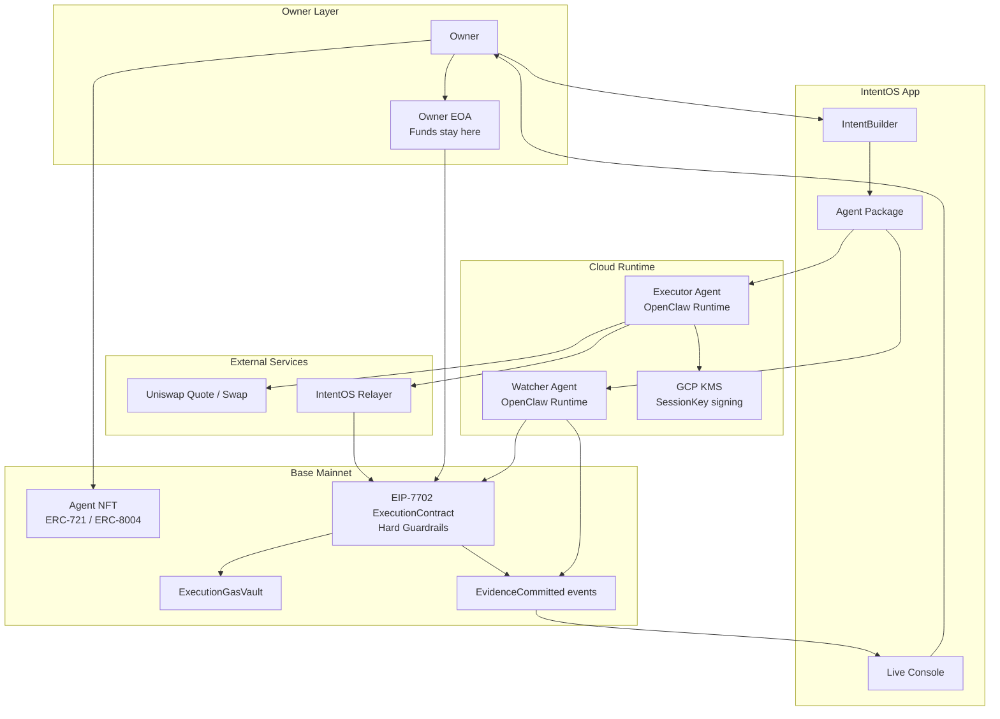
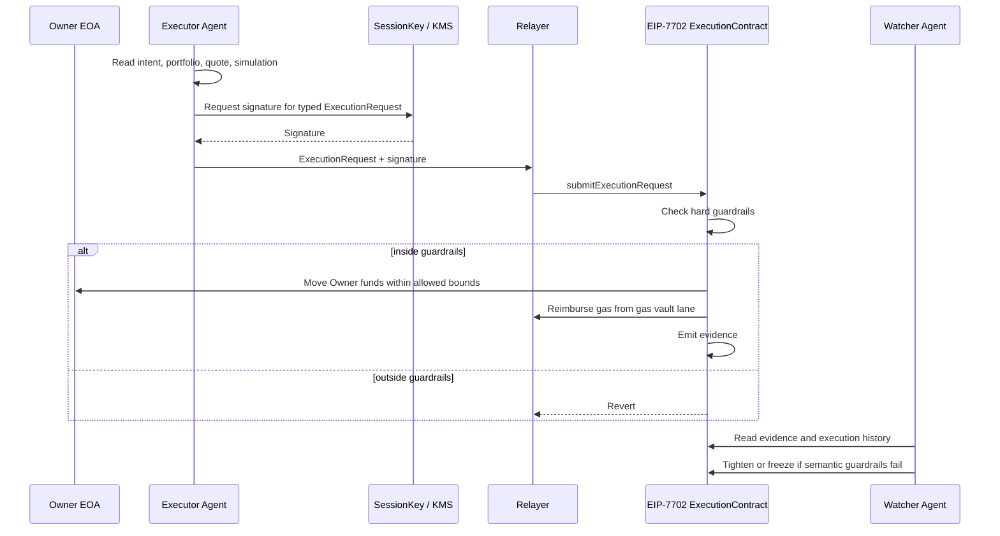

# IntentOS for ETHGlobal NYC 2026

## Please refer to the doc/plan folder for detailed planning documents.

https://github.com/rtree/2026NYC-ethglobal/tree/main/doc/plan

Build and layout notes: [doc/BUILD.md](doc/BUILD.md)

## Current Repository Layout

```text
app/
  web/                 React + Vite control panel
  agent/
    openclaw/          Cloud Run OpenClaw gateway wrapper
packages/
  shared/              Shared TS types, config, ABIs, KMS signer
  runtime/             Quote, request build/sign, relayer, executor helpers
  server/              Control-plane API + static web serving
contracts/             Foundry contracts and tests
deployment/            Public deployment addresses (no secrets)
doc/                   North Star, SDD, issues, mocks, deck
scripts/               Build/deploy/operator scripts
```

---

# IntentOS - Guarded Execution Layer for AI Agents

> *Let agents act while your wallet stays yours.*

## One-liner

**IntentOS is an EIP-7702 guarded-execution layer where AI agents can trade inside owner-defined hard limits, while funds stay in the Owner's own EOA.**

---

# Idea

IntentOS lets an Owner describe a trading intent, mint an AI Agent NFT, and run that Agent in an isolated cloud runtime without handing it custody of funds.

Instead of choosing between:
- approving every transaction manually
- or giving an AI agent full wallet authority

IntentOS creates a middle layer:

> **The Agent can request execution, but the Owner's EIP-7702 delegated account decides what is allowed.**

The MVP focuses on **USDC <-> WETH trades on Base mainnet**, with strict hard guardrails and a Watcher Agent that can only tighten or freeze future execution.

---

# How it works

## 1. The Owner defines an Intent

The Owner connects a wallet, proves personhood, and tells the IntentBuilder what they want:

- swap USDC into WETH gradually
- stop on large price movement
- avoid stale quotes or suspicious routes
- recover back to a stable asset when execution fails

The IntentBuilder turns this into an Agent Package with:

- the Agent's goal and behavior
- hard guardrails the contract enforces
- semantic guardrails the Watcher checks after execution

---

## 2. The Executor Agent is minted

The Executor Agent is minted as an Agent NFT.

This NFT represents:

- the Agent identity
- the right to run the cloud Runtime
- the manifest hash of the Agent Package it must obey
- access to request execution through the Owner's delegated account

It does **not** receive custody of funds.

---

## 3. A cloud Runtime starts the Agent

IntentOS provisions an OpenClaw Runtime Capsule on Cloud Run for the Agent.

The Runtime keeps ticking even if the Owner's laptop is asleep. It can read market state, portfolio state, guardrails, quotes, simulations, and evidence.

But the Runtime does not receive a private key that can move funds. It only receives a SessionKey that can sign typed ExecutionRequests.

---

## 4. The Agent requests, the contract decides

On each tick, the Executor Agent chooses:

- BUY
- SELL
- HOLD
- RECOVER

If it wants to trade, the IntentOS adapter builds a typed ExecutionRequest and the SessionKey signs it.

The ExecutionContract inside the Owner's EIP-7702 delegated account checks the request against hard guardrails:

- allowed token pair
- amount cap
- slippage cap
- expiry
- nonce
- freeze state
- bound target and selector

If the request is inside the limits, it executes. If not, it reverts.

---

## 5. Funds never leave the Owner's account

The core design is:

> **Funds are never handed to the Agent. They move only inside the Owner's own EOA.**

EIP-7702 lets the Owner's EOA carry delegated account code. The ExecutionContract and guardrails live inside that delegated account.

The Agent cannot:

- export a private key
- send arbitrary transactions
- generate arbitrary calldata
- loosen policy
- replace the delegated contract
- move funds outside the guardrails

---

## 6. Gas is separated from custody

The Relayer submits transactions and fronts gas.

The Owner prefunds an ExecutionGasVault lane inside the delegated account. After execution, the contract reimburses the Relayer up to the gas cap.

This separates:

- the signer: SessionKey
- the sender: Relayer
- the fund owner: Owner EOA
- the final authority: ExecutionContract

---

## 7. The Watcher Agent can only tighten

The Owner can mint a separate Watcher Agent NFT.

The Watcher reads contract events, quotes, simulations, reasoning hashes, and execution evidence. It checks whether the Executor stayed on-intent.

If something looks wrong, the Watcher can report and vote to:

- tighten future limits
- freeze execution

It cannot loosen guardrails. Only the Owner can loosen.

---

# Key Innovations

### EIP-7702 self-custody execution

The Owner keeps funds in their own EOA, while delegated account code enforces execution limits.

---

### AI Agent without wallet custody

The Agent can reason, quote, simulate, and request execution, but it never receives a key that can freely move funds.

---

### Hard guardrails before execution

The contract does not trust the LLM. It only checks typed constraints and executes or reverts mechanically.

---

### Watcher Agent after execution

Semantic risks that cannot be fully checked onchain, such as unnatural routes or stale evidence, are monitored by a separate Agent that can only reduce risk.

---

### Agent NFT as runtime access right

Agent NFTs represent identity, package binding, delegated-account access, and the right to run the cloud Runtime.

---

# Architecture

## High-Level System Architecture



---

## Execution Flow



---

# Tech Stack

| Layer | Technology | Why it's notable |
| --- | --- | --- |
| Chain | Base mainnet, EIP-7702 delegated accounts | Real production network; per-EOA delegation (each Owner wears the same guard code with its own storage and funds) |
| Assets | USDC, WETH | Fixed pair for the MVP guardrails |
| Execution | EIP-7702 `ExecutionDelegate7702`, Hard Guardrails, `ExecutionGasVault` | The Owner's EOA *is* the policy-enforcing account; `onlyOwner` = `msg.sender == address(this)` self-call |
| **Owner identity (login)** | **SIWE (EIP-4361) Web3 sign-in → Firebase custom token → Firebase Auth** | **The wallet signature is the primary credential; the server mints a Firebase custom token from the verified SIWE message, so per-wallet data (drafts, history, runtime state) is scoped to the signed-in address with no passwords** |
| **EIP-7702 activation** | **Local Activation Kit — Ledger-first `signAuthorization` + type-4 self-tx** | **Browser wallets refuse to sign a 7702 authorization for a dApp-chosen contract (`Account type "json-rpc" is not supported`), so delegation is signed locally; Ledger is the safe hardware path (see Sponsor Tracks → Ledger)** |
| **RPC** | **Keyless server-side RPC proxy (Alchemy → Infura failover, 7702-aware)** | **The downloadable kit reaches a 7702-aware node through `POST /api/rpc` so the provider key never ships in public code; method-allowlisted + size-capped** |
| Agents | Executor Agent, Watcher Agent (quorum=1, tighten/freeze only) | Reasoning is never trusted; the contract checks typed constraints mechanically |
| Runtime | OpenClaw Runtime Capsules on Cloud Run | Always-on isolated runtime; receives a SessionKey that can only sign typed `ExecutionRequest`s, never a fund-moving key |
| Keys | GCP KMS SessionKey signing (HSM, sign-only, 0 ETH) | Signer (SessionKey) ≠ sender (Relayer) ≠ fund owner (EOA) ≠ authority (contract) |
| Agent identity | Agent NFT, ERC-721 / ERC-8004, ENS agent namespace | NFT = identity + package-hash binding + runtime access right; never custody |
| Frontend | React + Vite + wagmi + viem | Connect → SIWE → `ActivateGate` → IntentBuilder |
| Backend | Node on Cloud Run, Firestore store, Vertex AI (LLM) | Stateless write-path gated by verified Firebase ID token |
| Trading | Uniswap SwapRouter02 quote / swap flow (USDC/WETH, fee 500) | Bounded `exactInputSingle` only; target + selector allow-listed in the guard |
| Evidence | Onchain events, quote hashes, simulation hashes, reasoning hashes | `EvidenceCommitted` is the audit origin, not an offchain log |

> **Engineering highlights worth a second look**
> - **Web3 login wired into Firebase Auth.** SIWE (EIP-4361) is the credential; a verified signature is exchanged server-side for a Firebase custom token, then a Firebase ID token gates every money/LLM write. No email, no password — your wallet *is* your account.
> - **Ledger was effectively mandatory to register the EIP-7702 contract.** A browser wallet cannot delegate an EOA to a dApp-chosen implementation, so without a local/hardware signer there is no way to start. Ledger makes that one-time delegation safe (key never leaves the device).
> - **A keyless RPC proxy** lets an install-free, publicly downloadable activation kit talk to a 7702-aware node without ever shipping an API key.

---

# Sponsor Tracks

## Ledger — device-backed trust as the *enabler*, not a badge

> **Ledger is not decoration in IntentOS — it is the only safe way to start the protocol at all.**

### Why an AI agent needs EIP-7702 self-custody (and why that needs Ledger)

To let an AI agent trade *without* taking custody of funds, the policy has to live **on the user's own EOA**. EIP-7702 is the right primitive for exactly this:

- **EIP-7702 = true self-custody.** The Owner's EOA carries delegated guard code, but the funds, storage, and final authority stay on that same EOA. The Owner can **un-delegate at any moment** and instantly return to a plain EOA — there is nothing else to exit.
- **A contract wallet (Safe-style) is *not* this.** Moving assets into a smart-contract wallet means the funds now live **away from the EOA**, behind that contract's own rules and signer set. If the user wants to stop, they must migrate funds back out — there is no instant, unilateral "it's just my EOA again." For an agent that holds spending power, that delay is the whole risk. EIP-7702 keeps the off-switch in the user's hand.

So EIP-7702 is the correct trust model for agent self-custody. **The problem is starting it.**

### The blocker: browsers can't delegate an EOA to a dApp-chosen contract

Activating EIP-7702 means signing an **authorization** that points your EOA at our `ExecutionDelegate7702` implementation. We found that **browser/injected wallets refuse to do this**:

```
Account type "json-rpc" is not supported.
The signAuthorization Action does not support JSON-RPC Accounts.
```

MetaMask (and injected wallets generally) will **only** 7702-delegate to **their own** smart-account implementation. There is no JSON-RPC method for a dApp to request delegation to an arbitrary implementation. `signAuthorization` is a **local-account-only** action. So the browser path is a dead end — and signing a 7702 authorization by **pasting a raw private key** is exactly the catastrophic key-handling pattern we never want users to do.

### Ledger is what makes it safe — and therefore effectively mandatory

A hardware wallet is the clean way out: the **authorization tuple and the type-4 transaction are signed on the device, and the private key never leaves it.** That is precisely the operation our Local Activation Kit performs through Ledger:

- [scripts/activate-kit/ledger.mjs](scripts/activate-kit/ledger.mjs) wraps the Ledger Ethereum app as a viem **custom account** exposing the two operations activation needs:
  - `signAuthorization(...)` — sign the **EIP-7702 authorization tuple**
  - `signTransaction(...)` — sign the **EIP-7702 (type-4) self-transaction** (delegate + `initialize` in one tx)
- [scripts/activate-kit/activate.mjs](scripts/activate-kit/activate.mjs) is install-free (viem inlined), offers **[1] Ledger (recommended)** or **[2] dedicated imported key**, detects an existing delegation, and broadcasts one type-4 tx that delegates the EOA and initializes the Hard Guardrails.

**Without device-backed signing, onboarding to an agent-trading protocol means either a wallet that won't sign, or a user pasting a seed phrase. Ledger is the difference between "impossible / dangerous" and "safe and one-click." That is why it is the explicit control layer of IntentOS, not a logo.**

### How this maps to the track

- **Device-backed security is central, not bolted on** — the product cannot be entered safely without a hardware (or dedicated local) signer; Ledger is the recommended, safe default.
- **Human-in-the-loop for the one sensitive action** — the single high-risk, authority-granting step (delegating your EOA) is the step we route to the device. Everything *after* that runs inside hard guardrails with a sign-only SessionKey, so recurring trades need zero further signatures while the irreversible authority grant stays on the device.
- **Concrete use of Ledger primitives, not branding** — we call `signAuthorization` + type-4 `signTransaction` via `@ledgerhq/hw-app-eth` over `@ledgerhq/hw-transport-node-hid`, not just "connect a Ledger."

### Feedback on Ledger docs & SDKs (qualification)

Honest developer feedback from building this, intended to help:

- **EIP-7702 authorization signing is the biggest gap.** It was unclear from `@ledgerhq/hw-app-eth` docs whether/which firmware + Ethereum-app versions can clear-sign an **EIP-7702 authorization tuple** (not just a normal tx). We had to treat it as experimental and fail loudly with a fallback. A first-class, documented `signEIP7702Authorization` example — with the minimum app/firmware version stated up front — would remove the single biggest unknown for any 7702 onboarding flow.
- **Clear-signing for a type-4 tx that carries an `authorizationList`.** It is not obvious how the device surfaces "you are delegating this EOA to contract `0x…`" to the user. Documented Clear Signing artifacts for the delegation target (so the device shows the impl address and the "initialize" intent in human terms) would make this dramatically safer to ship.
- **Node HID transport packaging.** `@ledgerhq/hw-transport-node-hid` is a native module and **cannot be bundled** (we ship it as an external the user installs once). A documented "install-free / bundler-friendly" transport story, or an official note on the expected externals, would smooth distribution of CLI tools like our kit.
- **What worked well.** The viem `toAccount` custom-account pattern made wrapping the Ledger signer for both `signAuthorization` and `signTransaction` clean once the signature normalization (r/s/v → `yParity`) was understood.

---

## World ID — Track B: the product breaks without proof of human

> **IntentOS gives each verified human their own always-on cloud trading agent. Without proof of human, that model collapses — so World ID isn't a feature here, it's the precondition.**

### What breaks without it (the honest justification)

Every Owner who onboards gets a **real, always-on OpenClaw Runtime Capsule on Cloud Run** (one per Agent), plus server-side LLM (Vertex) calls and chain indexing — all paid by us, the operator. The whole product is "an autonomous agent that keeps trading while you sleep," which *requires* real provisioned compute per user.

That is exactly the kind of **limited, costly, per-human resource** World ID Track B is about. With only a wallet gate:

- **One person spins up unlimited agents.** A script makes 10,000 EOAs, signs in to each (SIWE is free), and farms 10,000 cloud runtimes + LLM spend. Our compute/model/indexer budget is drained by a single actor. The product is **economically dead on day one**.
- **No fair allocation.** Any "free runtime for new users", rate limit, or allowlist is meaningless if one human is unlimited wallets.

So personhood is not decoration — **it is the eligibility constraint that makes "one always-on agent per human" possible at all.** Remove it and the core offering can't exist.

### How World ID 4.0 is used as a real constraint

- **One human → one human-verified account.** We use the **Proof of Human** credential (`proofOfHuman`, World ID 4.0 with legacy Orb fallback). The proof's **nullifier** is the per-app, per-action unique human id. We store `(action, nullifier)` with a **uniqueness constraint**, so the same human can't pass the gate on many wallets — `1 human = 1 verified onboarding`.
- **The gate is the eligibility check for the costly resource.** `humanVerified(uid)` is what unlocks onboarding into the runtime-provisioning flow. The proof is **bound to the Owner's EOA** (`signal = address`), and the server re-checks that binding, so a proof can't be lifted onto another account.
- **Proof validation happens in our web backend — required and real.** The browser only collects the proof via IDKit; the **server** signs the RP request and forwards the proof **byte-for-byte** to `POST https://developer.world.org/api/v4/verify/{rp_id}`. A client can return any JSON it likes — only the server-side verify is trusted. The RP signing key lives **only in GCP Secret Manager**, never in the bundle.

```
Browser (IDKit, proofOfHuman, signal = Owner EOA)
   │  1. POST /api/worldid/sign      → server signs the RP request (key from Secret Manager)
   │  2. World App makes a ZK proof of human
   ▼
Server  3. POST /api/worldid/verify  → forwards proof to developer.world.org/api/v4/verify/{rp_id}
        4. enforce signal == EOA, store (action, nullifier) UNIQUE, set humanVerified(uid)
        ⇒ only now can this human onboard their always-on agent
```

### Qualification checklist (Track B)

| Requirement | IntentOS |
| --- | --- |
| **World ID 4.0 as a real constraint** | Proof of Human (`proofOfHuman`) is the **eligibility + uniqueness** gate for per-human cloud runtimes; `1 human = 1 verified onboarding` via nullifier uniqueness |
| **What breaks without it** | One human → unlimited wallets → unlimited paid cloud runtimes + LLM spend ⇒ the "always-on agent per human" economics collapse (Sybil-farmed compute) |
| **Working application** | Live (not a mini app): onboarding gate at the panel; `/api/config` advertises `worldIdRequired`, IDKit widget verifies via World App |
| **Proof validation in a web backend** | Yes — verified server-side via `developer.world.org/api/v4/verify/{rp_id}`; RP signing key in Secret Manager; nullifier persisted with a uniqueness constraint; never trusted from the client |

### Where it lives in the code

- Server: [packages/server/src/worldid.ts](packages/server/src/worldid.ts) (RP signing + server-side verify + signal binding), routes `POST /api/worldid/sign` · `POST /api/worldid/verify` · `GET /api/worldid/status` · `POST /api/worldid/reset` in [packages/server/src/server.ts](packages/server/src/server.ts), nullifier-uniqueness + `humanVerified` persistence in [packages/server/src/store.ts](packages/server/src/store.ts).
- Client: [app/web/src/WorldIdButton.tsx](app/web/src/WorldIdButton.tsx) (IDKit `proofOfHuman`, `signal = address`), gate is **server-driven** (`/api/worldid/status`) in [app/web/src/gate.ts](app/web/src/gate.ts) so a stale local flag can't bypass it.

> SDKs: `@worldcoin/idkit@4` (React widget) + `@worldcoin/idkit-core@4` (`signRequest`, `hashSignal`). The IDKit wasm is lazy-loaded so it only downloads when the gate is reached. Design notes: [doc/plan/110-worldid-integration.md](doc/plan/110-worldid-integration.md).

---

# Q&A

## "Why not just let the AI hold a wallet?"

> **Because the Agent should not be the final authority over funds. IntentOS lets the Agent request execution, but the Owner's delegated account enforces the limits.**

---

## "What happens if the Agent goes rogue?"

> **The contract checks every request against hard guardrails before execution. A rogue request can be submitted, but it cannot pass if it is outside the allowed bounds.**

---

## "What if the LLM makes a subtle mistake the contract cannot understand?"

> **That is the Watcher Agent's job. It reads evidence after execution and can tighten or freeze future execution when semantic guardrails fail.**

---

## "Can the Watcher steal funds or loosen the policy?"

> **No. The Watcher has no fund access and can only move guardrails in a more restrictive direction. Only the Owner can loosen.**

---

## "Where are the funds while the Agent runs?"

> **They remain in the Owner's EOA. EIP-7702 adds delegated account code to that EOA, so execution is guarded without transferring custody to the Agent or to a vault.**

---

## "What does the Agent NFT represent?"

> **It represents Agent identity, package binding, runtime usage rights, and access to request execution through the Owner's delegated account. It does not represent custody of the Owner's funds.**

---

# Closing Line

> **IntentOS lets AI agents act onchain while the Owner keeps custody and the contract keeps the boundary.**
