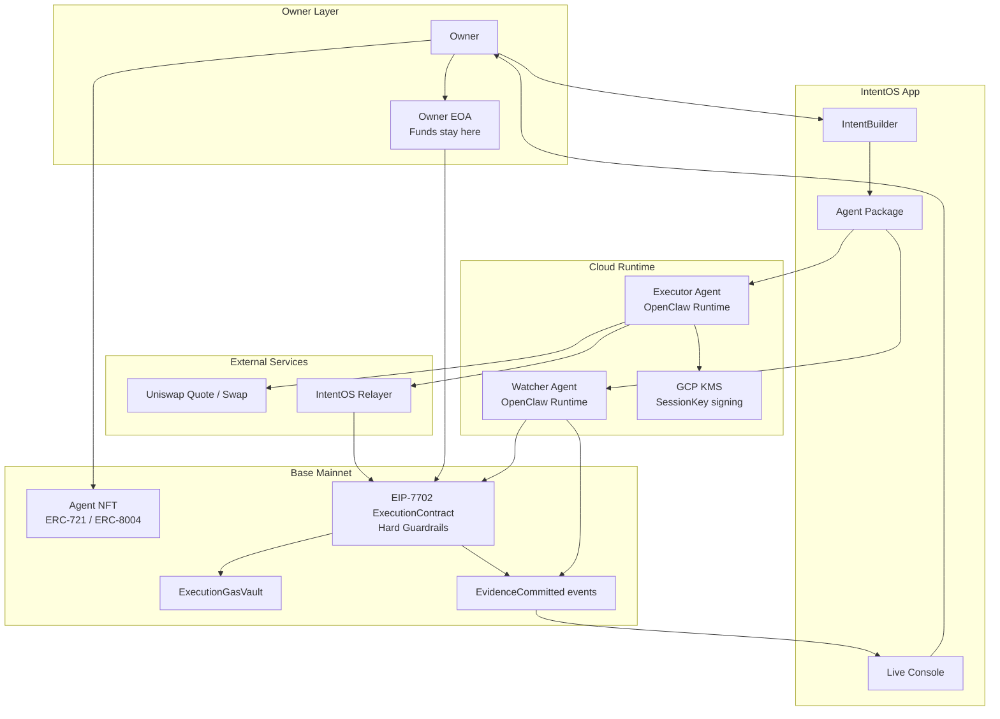
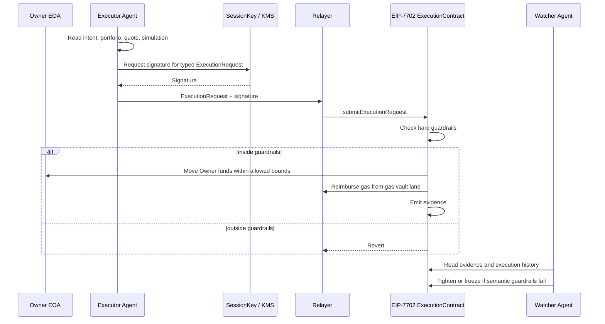

# IntentOS for ETHGlobal NYC 2026

## Please refer to plan folder to detailed plannning document.

https://github.com/rtree/2026NYC-ethglobal/tree/main/plan

---

# IntentOS - Guarded Execution Layer for AI Agents

> *Let agents act while your wallet stays yours.*

## One-liner

**IntentOS is an EIP-7702 guarded-execution layer where AI agents can trade inside owner-defined hard limits, while funds stay in the Owner's own EOA.**

---

# Idea

IntentOS lets an Owner describe a trading intent, mint an AI Agent NFT, and run that Agent in an isolated cloud runtime without handing it custody of funds.

Instead of choosing between:
- approving every transaction manually
- or giving an AI agent full wallet authority

IntentOS creates a middle layer:

> **The Agent can request execution, but the Owner's EIP-7702 delegated account decides what is allowed.**

The MVP focuses on **USDC <-> WETH trades on Base mainnet**, with strict hard guardrails and a Watcher Agent that can only tighten or freeze future execution.

---

# How it works

## 1. The Owner defines an Intent

The Owner connects a wallet, proves personhood, and tells the IntentBuilder what they want:

- swap USDC into WETH gradually
- stop on large price movement
- avoid stale quotes or suspicious routes
- recover back to a stable asset when execution fails

The IntentBuilder turns this into an Agent Package with:

- the Agent's goal and behavior
- hard guardrails the contract enforces
- semantic guardrails the Watcher checks after execution

---

## 2. The Executor Agent is minted

The Executor Agent is minted as an Agent NFT.

This NFT represents:

- the Agent identity
- the right to run the cloud Runtime
- the manifest hash of the Agent Package it must obey
- access to request execution through the Owner's delegated account

It does **not** receive custody of funds.

---

## 3. A cloud Runtime starts the Agent

IntentOS provisions an OpenClaw Runtime Capsule on Cloud Run for the Agent.

The Runtime keeps ticking even if the Owner's laptop is asleep. It can read market state, portfolio state, guardrails, quotes, simulations, and evidence.

But the Runtime does not receive a private key that can move funds. It only receives a SessionKey that can sign typed ExecutionRequests.

---

## 4. The Agent requests, the contract decides

On each tick, the Executor Agent chooses:

- BUY
- SELL
- HOLD
- RECOVER

If it wants to trade, the IntentOS adapter builds a typed ExecutionRequest and the SessionKey signs it.

The ExecutionContract inside the Owner's EIP-7702 delegated account checks the request against hard guardrails:

- allowed token pair
- amount cap
- slippage cap
- expiry
- nonce
- freeze state
- bound target and selector

If the request is inside the limits, it executes. If not, it reverts.

---

## 5. Funds never leave the Owner's account

The core design is:

> **Funds are never handed to the Agent. They move only inside the Owner's own EOA.**

EIP-7702 lets the Owner's EOA carry delegated account code. The ExecutionContract and guardrails live inside that delegated account.

The Agent cannot:

- export a private key
- send arbitrary transactions
- generate arbitrary calldata
- loosen policy
- replace the delegated contract
- move funds outside the guardrails

---

## 6. Gas is separated from custody

The Relayer submits transactions and fronts gas.

The Owner prefunds an ExecutionGasVault lane inside the delegated account. After execution, the contract reimburses the Relayer up to the gas cap.

This separates:

- the signer: SessionKey
- the sender: Relayer
- the fund owner: Owner EOA
- the final authority: ExecutionContract

---

## 7. The Watcher Agent can only tighten

The Owner can mint a separate Watcher Agent NFT.

The Watcher reads contract events, quotes, simulations, reasoning hashes, and execution evidence. It checks whether the Executor stayed on-intent.

If something looks wrong, the Watcher can report and vote to:

- tighten future limits
- freeze execution

It cannot loosen guardrails. Only the Owner can loosen.

---

# Key Innovations

### EIP-7702 self-custody execution

The Owner keeps funds in their own EOA, while delegated account code enforces execution limits.

---

### AI Agent without wallet custody

The Agent can reason, quote, simulate, and request execution, but it never receives a key that can freely move funds.

---

### Hard guardrails before execution

The contract does not trust the LLM. It only checks typed constraints and executes or reverts mechanically.

---

### Watcher Agent after execution

Semantic risks that cannot be fully checked onchain, such as unnatural routes or stale evidence, are monitored by a separate Agent that can only reduce risk.

---

### Agent NFT as runtime access right

Agent NFTs represent identity, package binding, delegated-account access, and the right to run the cloud Runtime.

---

# Architecture

## High-Level System Architecture

---

## Execution Flow

---

# Tech Stack

| Layer | Technology |
| --- | --- |
| Chain | Base mainnet, EIP-7702 delegated accounts |
| Assets | USDC, WETH |
| Execution | EIP-7702 ExecutionContract, Hard Guardrails, ExecutionGasVault |
| Agents | Executor Agent, Watcher Agent |
| Runtime | OpenClaw Runtime Capsules on Cloud Run |
| Keys | GCP KMS SessionKey signing |
| Identity | Agent NFT, ERC-721 / ERC-8004, ENS agent namespace |
| Trading | Uniswap quote / swap flow |
| Evidence | Onchain events, quote hashes, simulation hashes, reasoning hashes |

---

# Q&A

## "Why not just let the AI hold a wallet?"

> **Because the Agent should not be the final authority over funds. IntentOS lets the Agent request execution, but the Owner's delegated account enforces the limits.**

---

## "What happens if the Agent goes rogue?"

> **The contract checks every request against hard guardrails before execution. A rogue request can be submitted, but it cannot pass if it is outside the allowed bounds.**

---

## "What if the LLM makes a subtle mistake the contract cannot understand?"

> **That is the Watcher Agent's job. It reads evidence after execution and can tighten or freeze future execution when semantic guardrails fail.**

---

## "Can the Watcher steal funds or loosen the policy?"

> **No. The Watcher has no fund access and can only move guardrails in a more restrictive direction. Only the Owner can loosen.**

---

## "Where are the funds while the Agent runs?"

> **They remain in the Owner's EOA. EIP-7702 adds delegated account code to that EOA, so execution is guarded without transferring custody to the Agent or to a vault.**

---

## "What does the Agent NFT represent?"

> **It represents Agent identity, package binding, runtime usage rights, and access to request execution through the Owner's delegated account. It does not represent custody of the Owner's funds.**

---

# Closing Line

> **IntentOS lets AI agents act onchain while the Owner keeps custody and the contract keeps the boundary.**
