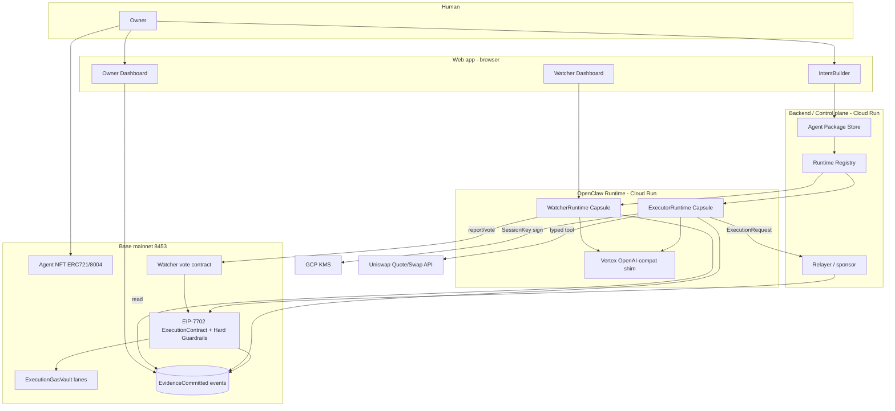
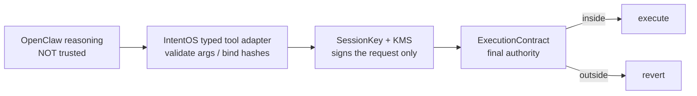

# IntentOS — Seam Freeze (Shared Interfaces)

> This is the **narrow waist** of the project. Every later artifact (mocks, SDD, contracts, runtime,
> frontend) reads from this file. Conceptual rationale lives in [000-northStar-en.md](000-northStar-en.md);
> this file fixes the *shared vocabulary and data contracts* those concepts compile down to.
>
> Scope: **MVP "B"** — Executor full vertical slice + single Watcher (quorum=1), USDC<->WETH, Base
> mainnet + Cloud Run. Anything marked `(future)` is intentionally out of MVP and listed only so the
> shape does not have to change later.
>
> Rule of thumb: if a name, field, state, or error appears in a mock or the SDD, it must appear here
> first. If you need a new one, add it here, then use it.

---

## 1. Glossary

| Term | Definition |
| --- | --- |
| Owner | The human who holds the funds. Never gives up custody; the only actor who can loosen a guard. |
| Executor Agent | `role=EXECUTOR` Agent NFT. A signal executor that runs the Owner's Intent. Holds no custody. |
| Watcher Agent | `role=WATCHER` Owner-created Agent NFT. Monitors execution and only issues tightening report / vote. No fund access. |
| OpenClaw Runtime | The always-on execution base that runs the AgentLoop. Holds no onchain authority. |
| IntentBuilder | Turns the Owner's Natural Intent into an Agent Package. |
| Agent Package | `manifest` + `SUMMARY` / `AGENTS` / `SOUL` / `TOOLS` / `MEMORY` / `EVIDENCE` / `STOP` / `CONSTRAINTS` config files. |
| packageHash | The parent hash of `manifest.json`. Referenced by the NFT, the Registry, and evidence. |
| Hard Guardrails | Mechanical constraints the ExecutionContract enforces synchronously (target / selector / tokenPair / cap / slippage / expiry / freeze / nonce). |
| Semantic Guardrails | Expectations the Watcher Agent judges after the fact (route naturalness / quote freshness / simulation adequacy / recovery soundness). |
| ExecutionContract | The final authority. Looks only at whether a request is inside the Hard Guardrails, then executes / reverts. |
| ExecutionRequest | A typed "one trade for this tick" assembled by the adapter. Not an arbitrary calldata submitter. |
| SessionKey | A key dedicated to signing ExecutionRequests (cannot freely move funds). Signs via KMS. |
| Relayer | The sender that fronts tx gas. Reimbursed from the ExecutionGasVault lane. |
| ExecutionGasVault | A gas reimbursement lane inside the delegated account (not a standalone sponsor). Separate lanes for Executor / Watcher. |
| Runtime Binding | A non-transferable binding. Valid only while `ownerOf(tokenId) == runtimeOwner`. |
| bindingNonce | Binding generation. Invalidated on transfer, reverting old requests. |
| EvidenceCommitted | The event carved onto Base per execution. The canonical audit origin. `reason` is English ASCII <= 200 chars. |
| World ID | A human-proof gate after Web3 login. Does not imply using World Chain; prevents Cloud Run Runtime abuse / cost blow-up. |
| quorum | The Watcher votes required to enact tighten / freeze. MVP: **1**. |
| tighten / freeze | Narrow / freeze the Hard Guardrails (Watcher only tightens; only the Owner loosens). |

---

## 2. Canonical constants

> Standard token/chain values are stable. Project-specific infra values (domain, GCP, KMS) are the
> current target and may move; treat them as the single source of truth and update here if they change.

```text
App / chain
  Web app           : https://intentos.arkt.me/
  ENS namespace     : agent-<tokenId>.intentos.base.eth / watcher-<tokenId>.intentos.base.eth
  Base chainId      : 8453
  USDC (Base)       : 0x833589fCD6eDb6E08f4c7C32D4f71b54bdA02913
  WETH (Base)       : 0x4200000000000000000000000000000000000006

Infra (target)
  GCP project       : ethglobal-nyc2026-rtree (numeric 41929375451)
  GCP region        : us-central1
  KMS               : global / intentos / intent-decrypt
  OpenClaw image    : ghcr.io/openclaw/openclaw:latest
  Cloud Run service : intentos-openclaw-gateway
  Model             : Vertex gemini-2.5-flash (via OpenAI-compat shim / Cloud Run ADC)

Protocol limits
  reason field      : non-compressed English ASCII, <= 200 chars, no secrets / no markdown
  tradingPair (MVP) : USDC <-> WETH only
  watcher quorum    : 1 (MVP)
  active intents    : 1 per Owner (MVP)
```

---

## 3. Layer & responsibility map

One layer = one responsibility. The trust boundary (§5) rides on top of this layering: if an upper
layer breaks, the lower layer still protects funds.

```text
Identity layer   Who / which Agent.        NFT / ERC-8004 / ENS.
Intent layer     What to do / boundaries.  IntentBuilder / Agent Package / Guardrails.
Runtime layer    Where it keeps running.   Registry / Capsule / Binding / GasVault.
Chain layer      What passes/stops/records.ExecutionContract / Evidence / Vote.
Agent layer      How it thinks / acts.     Executor Agent / Watcher Agent loop.
UX layer         How a human experiences.  Screen state machines (§12, mocks).
```

---

## 4. System map (MVP)



---

## 5. Trust boundary model

The most important design principle: **requests flow top-down, but authority stays in the Chain
layer.** If an upper layer (LLM / adapter / SessionKey) is compromised, the lower layer
(ExecutionContract + Hard Guardrails) still protects the funds.



| Boundary | What is NOT trusted | What is enforced |
| --- | --- | --- |
| OpenClaw -> adapter | LLM output (nothing beyond the action name / reason text) | adapter type-checks args and binds quote / sim / evidence hashes |
| adapter -> SessionKey | arbitrary calldata | signs only a typed ExecutionRequest |
| SessionKey -> Contract | the mere ability to sign | the Contract checks against Hard Guardrails |
| Runtime -> all onchain | an old binding still running | every authority op requires `ownerOf(tokenId) == runtimeOwner` |

Authority **never** given to OpenClaw (these do not exist as logical tools at all):

```text
arbitrary shell / arbitrary URL fetch / arbitrary contract call / arbitrary calldata generation /
private key export / policy loosen / delegate contract change / ExecutionGasVault replacement
```

---

## 6. Agent NFT onchain data model

ERC721 / ERC-8004-compatible. Executor and Watcher share a base and add role-specific fields. Fields
marked `(future)` are not written in the MVP.

```text
Agent NFT (common base):
  tokenId
  role                  EXECUTOR | WATCHER
  owner
  tokenURI              -> ERC-8004 registration JSON
  agentManifestHash     -> Agent Package manifest.json packageHash
  runtimeManifestHash
  erc8004RegistrationHash   (future)

Executor Agent NFT (adds):
  fundOwner             -> address that holds the funds (custody does NOT move to the NFT)
  intentId
  executionContract     -> the bound EIP-7702 ExecutionContract
  hardGuardrailsHash

Watcher Agent NFT (adds):
  watchedExecutorTokenId
  watchedIntentId
  executorPackageHash
  hardGuardrailsHash
  semanticGuardrailsHash
  watcherPackageHash
  quorumSetId
```

- `agentManifestHash` points at the Agent Package `manifest.json` `packageHash`. The Runtime Registry
  looks up the package by this hash and injects it into the Capsule.
- Holding `fundOwner` on the NFT does **not** move fund custody. Transfer moves only identity and
  Runtime usage right (see §10).
- `(future)` fields deferred from MVP: `erc8004RegistrationHash`, `revenueReceiver`, `kmsPolicyHash`,
  `gasVaultPolicyHash`. Listed so the struct shape need not change when added.

---

## 7. Agent Package

A set of config files bundling the Agent's behavior, values, tools, memory, evidence, stop
conditions, and onchain constraints.

```text
agent-package/
  manifest.json
  SUMMARY.md         Owner-facing short intent summary
  AGENTS.md          OpenClaw system prompt / role / goal / allowed actions / never rules / default
  SOUL.md            risk posture / priority / default instinct / recovery preference
  TOOLS.md           description of the tools OpenClaw can see (description, NOT enforcement)
  MEMORY.md          what to store / not store in working memory
  EVIDENCE.md        per-tick evidence + hash commitment (the evidence contract the Watcher reads)
  STOP.md            stop / hold / self-stop conditions
  CONSTRAINTS.json   the Hard Guardrails to register into the ExecutionContract
```

`manifest.json` holds the parent hash of the whole package. The Agent NFT, the Runtime Registry, and
the evidence timeline reference this hash.

```json
{
  "packageVersion": "0.1",
  "agentRole": "EXECUTOR",
  "agentTokenId": "123",
  "intentId": "intent-abc",
  "packageHash": "0x...",
  "files": {
    "SUMMARY.md": "0x...",
    "AGENTS.md": "0x...",
    "SOUL.md": "0x...",
    "TOOLS.md": "0x...",
    "MEMORY.md": "0x...",
    "EVIDENCE.md": "0x...",
    "STOP.md": "0x...",
    "CONSTRAINTS.json": "0x..."
  }
}
```

A Watcher Agent package is a separate package (monitoring-only role / tools / stop policy) that
additionally pins, as immutable context: `watchedExecutorTokenId`, `watchedIntentId`,
`executorPackageHash`, `hardGuardrailsHash`, `semanticGuardrailsHash`.

The actual tool allowlist is enforced by the OpenClaw config, the IntentOS plugin, the Runtime
adapter, and the ExecutionContract — **not** by `TOOLS.md`, which is only a description.

---

## 8. intentos.* typed tools

Logical tool names shown to OpenClaw. Implementations bind to concrete surfaces held by the IntentOS
Runtime adapter. Keep both allowlists small.

```text
ExecutorRuntime tools:
  intentos.observe_state
  intentos.get_quote
  intentos.propose_swap
  intentos.simulate
  intentos.submit_execution_request
  intentos.record_evidence
  intentos.ask_watcher
  intentos.self_stop

WatcherRuntime tools:
  intentos.read_execution_timeline
  intentos.read_evidence
  intentos.ask_executor
  intentos.judge_on_intent
  intentos.submit_report
  intentos.vote_tighten
  intentos.vote_freeze
  intentos.self_stop

Concrete tool surfaces (Executor):
  Uniswap Quote API / Uniswap Swap API / onchain read / simulation provider /
  EIP-7702 transaction submitter / Executor <-> Watcher chat
```

`intentos.submit_execution_request` is **not** an arbitrary calldata submitter. It validates args,
binds the quote / simulation / evidence hashes, assembles a typed ExecutionRequest, signs it with the
SessionKey / KMS, and sends it to the EIP-7702 delegated account.

### Predefined actions

```text
Executor actions:
  HOLD / ASK_WATCHER / GET_UNISWAP_QUOTE / PROPOSE_SWAP / REQUEST_SIMULATION /
  SUBMIT_EXECUTION_REQUEST / SELF_STOP

Watcher actions:
  OBSERVE_EXECUTION / READ_EVIDENCE / ASK_EXECUTOR / JUDGE_ON_INTENT /
  REPORT_OK / REPORT_SUSPICIOUS / VOTE_TIGHTEN / VOTE_FREEZE / SELF_STOP
```

---

## 9. ExecutionRequest & HardGuardState

The protocol's core data contract. North Star references both throughout but never fixes their fields;
fixed here.

`HardGuardState` is the part of the Owner's Intent that can be mechanically enforced, mirrored into
contract state. The `CONSTRAINTS.json` the Owner reviewed in the IntentBuilder is burned 1:1 into
contract storage at initialize.

```text
HardGuardState (mirrored 1:1 from CONSTRAINTS.json into contract state):
  target            allowlist (contracts that may be called)
  selector          allowlist (functions that may be called)
  tokenPair         allowlist (e.g. USDC / WETH)
  amountCapPerTx    per-tx upper bound
  cumulativeCap     cumulative upper bound (spender cap)
  slippageCapBps    allowed slippage (bps, 50 = 0.5%)
  expiry            expiry of the whole guard
  frozen            bool (true stops all execution)
  nonce             execution nonce
  bindingNonce      tied to Runtime Binding (invalidated on transfer)
```

`ExecutionRequest` is a typed "one trade for this tick". A thin struct the adapter type-checks and
assembles — never arbitrary calldata.

```text
ExecutionRequest (assembled typed by the adapter; not arbitrary calldata):
  intentId
  executorAgentTokenId
  action            BUY | SELL | RECOVER  -> resolves to selector / target
  tokenIn / tokenOut
  recipient
  amountIn
  minAmountOut      derived from slippageCap
  quotedAmountOut
  slippageBps
  nonce
  deadline
  bindingNonce
  quoteHash
  simulationHash
  evidenceRoot
  reasonHash        keccak256(bytes(reason)); binds the emitted evidence reason to the signature
  sessionSignature  SessionKey(KMS) signature
```

The digest the SessionKey signs contains **no** natural-language Intent. It is
`EIP-191( keccak256(chainId, contractAddress, ExecutionRequest) )` — a fingerprint of this one trade.
Mixing in `chainId` and `contractAddress` prevents cross-chain / cross-contract replay. The on-chain
`submitExecutionRequest(r, reason, sig)` re-checks `keccak256(bytes(reason)) == r.reasonHash`, so the
emitted evidence `reason` is authentic (not relayer-tamperable).

Intent travels along two separated paths:

```text
Boundary (enforceable):
  CONSTRAINTS.json -> initialize() -> burned once into contract storage as HardGuardState
Intent (not enforceable):
  whole Agent Package -> committed to the contract as packageHash (body stays offchain)
  Semantic Guardrails -> the Watcher Agent reads evidence after the fact and judges
```

BUY / SELL is possible only because initialize already placed the Intent boundary (Hard Guardrails)
into contract state. With no Hard Guardrails present, execution reverts with `NotInitialized`. The
LLM's free judgment appears in each tick's ExecutionRequest; the immutable frame of the Intent is
fixed in contract state.

### ExecutionContract check order (mechanical; reasoning is never trusted)

```text
receive ExecutionRequest
  -> is bindingNonce current?                         (else BadBindingNonce)
  -> are tokenIn / tokenOut / recipient allowlisted?  (else BadToken / BadRecipient)
  -> amountIn <= amountCapPerTx?                       (else AmountTooLarge)
  -> cumulativeSpent + amountIn <= cumulativeCap?      (else CumulativeCapExceeded)
  -> slippageBps <= slippageCapBps?                    (else SlippageTooHigh)
  -> within deadline / expiry?                         (else Expired)
  -> nonce unused?                                     (else NonceUsed)
  -> not frozen?                                       (else GuardIsFrozen)
  -> SessionKey signature matches?                     (else BadSignature)
  -> all inside -> execute ; any outside -> revert
```

### Canonical custom errors

```text
AmountTooLarge / CumulativeCapExceeded / SlippageTooHigh / Expired /
BadToken / BadRecipient / NonceUsed / BadBindingNonce / GuardIsFrozen /
BadSignature / NotInitialized
```

---

## 10. Runtime Registry, Binding & authority enforce points

```text
RuntimeRecord (Backend source of truth):
  tokenId
  runtimeId
  runtimeOwner
  bindingNonce
  runtimeStatus
  cloudRunService
  runtimeManifestHash
  kmsKeyRef
  executionGasVaultRef
  lastHeartbeatAt

RuntimeBinding (valid only while ownerOf(tokenId) == runtimeOwner):
  tokenId
  runtimeOwner
  bindingNonce
  runtimeId
  sessionKey
  executionGasVaultLane
```

Spawn / resume decision:

```text
runtime does not exist        -> create a new Runtime Capsule
runtimeOwner == ownerOf        -> reuse the existing Runtime Capsule
runtimeOwner != ownerOf        -> old binding invalid; reject old authority ops; new owner re-binds
```

Transfer expiry is expressed by `bindingNonce`. `rotateBinding` raises the nonce; requests with the
old nonce revert. The same current-owner check is enforced at **every** authority point, so an old
Runtime that keeps running autonomously can do no meaningful onchain interaction:

```text
IntentOS tool adapter   : require ownerOf(tokenId) == runtimeOwner
KMS / SessionKey policy : require active bindingNonce
ExecutionGasVault       : require ownerOf(tokenId) == vaultOwner
ExecutionContract       : require active tokenId / bindingNonce / sessionKey
Watcher vote contract   : require ownerOf(watcherTokenId) == boundWatcher
```

ExecutionGasVault lanes live inside the Owner's EIP-7702 delegated account (not a standalone sponsor):

```text
Owner EOA delegated account:
  ExecutionContract
  Hard Guardrails
  Executor ExecutionGasVault    (Owner-funded execution budget)
  Watcher ExecutionGasVault     (Owner-funded monitoring budget; separate lane)
```

---

## 11. EvidenceCommitted event

The audit origin is this onchain event, not an offchain log. Offchain bodies are an optional later
adapter; correctness on this path starts from the Base event + hash commitment.

```solidity
event EvidenceCommitted(
    uint256 indexed executorAgentTokenId,
    bytes32 indexed intentId,
    bytes32 indexed executionId,
    uint8 action,
    bytes32 packageHash,
    bytes32 hardGuardHash,
    bytes32 semanticGuardHash,
    bytes32 evidenceRoot,
    bytes32 quoteHash,
    bytes32 simulationHash,
    bytes32 executionRequestHash,
    bytes32 resultHash,
    string reason
);
```

`reason`: non-compressed English ASCII, max 200 chars, no secrets / raw API responses / personal data
/ markdown.

---

## 12. Guard -> LLM feedback loop

The core mechanism that makes adversarial-authority governance actually work. **Never clamp the slice
amount in the adapter.** The Executor freely requests, the Contract passes or stops, and a rejection
is returned to the LLM as learning material.

```text
1. The Executor freely requests (it may even request above the cap)
2. Before submit, a static preflight via eth_call -> Hard Guardrails revert with e.g. AmountTooLarge (gas 0)
3. Pass the rejection { reason = contract custom-error name, amountCapPerTx, cumulativeRemaining }
   into the next decideSignal
4. The LLM reads it and re-requests inside the boundary -> success
5. maxAttemptsPerTick caps the retries (prevents infinite loops)
```

> Anti-pattern: `amount = min(requested, cap)` in the adapter hides the Guard's work and the LLM learns
> nothing. The fact that the Guard rejected is the value; returning the rejection reason unhidden
> adapts the LLM to stay inside the boundary. This is the running form of "the Executor requests; the
> ExecutionContract pre-approves or stops; only the Owner can loosen."

---

## 13. State machines

### Intent lifecycle (per Owner; MVP = 1 active)

```text
DRAFT -> PACKAGED -> MINTED -> IDENTITY_SET -> FUNDED -> RUNNING -> <terminal>
```

### Runtime status

```text
NONE -> SPAWNING -> RUNNING -> (STOPPING) -> STOPPED
                      |-> SELF_STOPPED
                      |-> UNBOUND   (after transfer; next stop check self-stops)
```

### Result / terminal states (canonical set — used by the Result screen and contract state)

```text
running          actively ticking
tightened        a Watcher vote narrowed future capability
frozen           a Watcher vote (or Owner) froze execution
self-stopped     the Executor chose SELF_STOP
owner-stopped    the Owner stopped it
fund-exhausted   the ExecutionGasVault lane was depleted
transferred      the NFT was transferred; old binding revoked
```

These exact strings are the contract/event vocabulary AND the UI status vocabulary. Do not invent
synonyms downstream.

---

## 14. Cross-cutting invariants

- **Evidence is canonical onchain.** Audit starts from the Base `EvidenceCommitted` event, not an
  offchain log. Offchain body is optional/after, never required on this path.
- **Idempotency / nonce.** `ExecutionRequest` carries `nonce`; `HardGuardState` carries `bindingNonce`.
  Transfer invalidates `bindingNonce`, reverting old requests.
- **Two time systems.** `expiry` is enforced by the Hard Guard (mechanical); quote `freshness` is
  judged by the Semantic Guard (meaning). Same "staleness", different stopping layer.
- **Secrets.** Never put secrets / raw API responses / personal data / markdown in `reason` or
  evidence. `reason` normalizes to non-compressed English ASCII, <= 200 chars.
- **Watcher only tightens.** No cap increase, no expiry extension, no unfreeze. Loosen / expand is
  Owner-only.
- **No agent custody.** Funds always remain at the Owner address; agents hold only request capability.

---

## 15. Screen list (bridge to mocks)

The mocks in [/mock](../mock) realize these screens. Each screen is bound to the states / hashes /
balances it must show, taken from the vocabulary above.

| # | Screen | Shows (from this doc) |
| --- | --- | --- |
| 010 | Owner onboarding | wallet connect + World ID human-proof gate |
| 020 | Intent List | 1 active Intent (Intent lifecycle §13), history -> Result |
| 030 | Intent Launch Dashboard | card grid; required vs optional (Watcher) cards |
| 040 | Intent creation (IntentBuilder) | SUMMARY / Hard Guardrails (§9) / Semantic Guardrails; mint Executor NFT |
| 050 | Agent identity setup | tokenId, ENS name, ERC-8004 registration (§2, §6) |
| 060 | Runtime / fund preparation | RuntimeRecord (§10), ExecutionGasVault funding |
| 070 | Watcher Agent creation | Watcher NFT (§6), immutable context, quorum=1 |
| 080 | Start | launch preconditions; Executor-only vs +Watcher |
| 090 | Owner Runtime Dashboard | AgentLoop log, Hard Guardrails, gas balance, shared execution timeline (§11) |
| 100 | Watcher Runtime Dashboard | EvidenceCommitted + reason + hashes; report / vote / tighten / freeze (§8, §12) |
| 110 | Result / Performance | terminal states (§13), USDC value delta, gas / runtime cost |

### 15.1 Information architecture v2 (M5 — live-demo redesign)

The 11 mocks above remain the **component source** (the controls/widgets are harvested from them),
but the live app collapses them into **3 authenticated destinations**. Rationale + full decisions:
[TASK.md](../TASK.md) M5. World ID stays inert until IDKit is wired (gate logic is testable with a mock).

| Route | Destination | Built from mocks | Notes |
| --- | --- | --- | --- |
| `#/` | Onboarding (010) | 010 | Gate 1 wallet (EIP-6963 picker) + Gate 2 World ID. Wallet sign = primary credential for Firebase Auth (§17). |
| `#/intents` | Intents hub (020) | 020 | Active Intent is **session/agent-scoped** (`session.executorTokenId`), NOT 7702 `delegated`. 1 active/Owner; while active, "Run new" disabled. Lists **past Intents** (history, §16). |
| `#/launch` | Launch wizard | 030+040+050+060+070+080 | **Single screen, master/detail.** Left = step nav, right = controls. Steps: ① Intent & Agent Packages → ② Executor Agent → ③ Watcher Agent → ④ Gas Funding → ⑤ Start Conditions. Footer "Complete required cards to start". |
| `#/console` | Live Console | 090+100+110 | Merge of Owner + Watcher + Result. Live guard/vaults/timeline + Owner controls (trade/resume) + Watcher controls (freeze/tighten). After stop → becomes Result. |

Step detail for `#/launch`:
- **① Intent & Agent Packages** — IntentBuilder conversation (§17 LLM) authors **both** Executor and
  Watcher AgentPackages at once. Right pane = dual AgentPackage preview, each with its `AGENTS.md`
  (objective / tools / Hard Guardrails / Semantic Guardrails / recovery) + a **FIX** button to freeze
  that package (§16 draft → fixed). No minting here. No "Setup steps" list.
- **② Executor Agent** — mint AgentNFT + EIP-7702 delegate + initialize HardGuardState. Agent
  identity (ENS `agent-<id>.intentos.base.eth` + ERC-8004) shown/created **inline**.
- **③ Watcher Agent** — mint Watcher AgentNFT (bound, quorum=1). Identity inline. Directly after ②.
- **④ Gas Funding** — fund executor/watcher lanes. No "Skip to Start". No separate Runtime Preview card.
- **⑤ Start Conditions** — real settings: AgentLoop period + Cloud Run TTL minutes (§18 StartConfig).
  Launch summary shows the **real** AgentPackage + Guardrails + identities + vaults.

---

## 16. Off-chain data store (M5)

> **On-chain is primary.** The chain is the only source of truth for money state (guard, vaults,
> balances, `cumulativeSpent`, the `EvidenceCommitted` / `GuardTightened` / `GuardFrozen` timeline).
> The store below holds ONLY what cannot live on-chain: pre-mint drafts, conversation transcripts,
> per-agent `AGENTS.md` text, Start config, and a per-wallet **history index**. On reconnect, chain
> wins; the store annotates. Backend `INTENTOS_STORE=memory|firestore` (memory for dev/e2e).

Firestore (Native mode), backend-only access via ADC (the browser never touches Firestore directly;
it goes through `/api/*`). Documents are **scoped to the authenticated wallet** (§17):

```text
users/{uid}/intents/{intentId}
  intentId        string   keccak slug, e.g. "intent-abc"
  title           string   "DCA USDC -> WETH"
  status          string   draft | live | stopped   (mirrors §13 terminal states; chain wins)
  createdAt       number   epoch ms
  executorTokenId string?  set after mint (links to chain)
  watcherTokenId  string?
  packages        { executor: AgentPackageDraft, watcher: AgentPackageDraft }
  startConfig     StartConfig (§18)

users/{uid}/intents/{intentId}/transcript/{turnId}
  role            "owner" | "agent"
  text            string
  at              number
```

`uid` is the CAIP-10 id from §17. `AgentPackageDraft` is the editable pre-mint form of the Agent
Package (§7): the same logical files, kept as text/JSON while authored, plus a `fixed: boolean` and a
computed `packageHash` once FIXed. On mint, the fixed draft's `CONSTRAINTS.json` becomes the on-chain
`HardGuardState` and its `packageHash` is what the AgentNFT/evidence reference.

```ts
interface AgentPackageDraft {
  role: "EXECUTOR" | "WATCHER";
  summary: string;        // SUMMARY.md
  agents: string;         // AGENTS.md (objective / tools / never-rules / default)
  soul: string;           // SOUL.md (risk posture / recovery preference)
  constraints: {          // CONSTRAINTS.json -> HardGuardState (§9)
    tokenA: Address; tokenB: Address; poolFee: number;
    amountCapPerTx: string; cumulativeCap: string; slippageCapBps: number; expiry: string;
  };
  semantic: string[];     // Semantic Guardrails the Watcher judges (route naturalness, quote freshness, ...)
  fixed: boolean;
  packageHash?: Hex;      // set when fixed
}
```

---

## 17. Auth — Web3 login → Firebase Auth (M5)

> Goal: a per-wallet identity that BOTH Firestore Security Rules (`request.auth.uid`) and our backend
> trust, and that gates the LLM endpoint so it is never an open proxy. The wallet signature is the
> primary credential; the server mints a Firebase **custom token**; the browser signs into Firebase
> Auth and uses the resulting **ID token** as the bearer for `/api/*`. Backend `INTENTOS_AUTH=firebase|off`.

```text
1. connect wallet (EIP-6963 picker)
2. GET  /api/auth/nonce?address=0x..     -> { nonce }            (server stores nonce, short TTL)
3. wallet signs the SIWE/EIP-4361 message (domain + nonce + chainId 8453)
4. POST /api/auth/web3 { message, signature }
     server: viem verifyMessage + check nonce + domain
          -> mint Firebase custom token (JWT, signed key-LESSLY via IAM Credentials signJwt + ADC)
     -> { customToken }
5. browser: POST identitytoolkit accounts:signInWithCustomToken?key=WEB_API_KEY  -> { idToken, refreshToken }
6. all protected /api/* calls send  Authorization: Bearer <Firebase ID token>
     server verifies ID token (node crypto vs securetoken x509 certs); request.uid = token.sub
```

- **uid** = CAIP-10 `eip155:8453:<lowercased address>`. Custom claims `{ address, chainId }`.
- **Custom token** is a JWT: `iss=sub=<CloudRun SA email>`,
  `aud=https://identitytoolkit.googleapis.com/google.identity.identitytoolkit.v1.IdentityToolkit`,
  `exp<=iat+3600`, `uid`. Signed via **IAM Credentials `signJwt`** REST (ADC; SA needs
  `roles/iam.serviceAccountTokenCreator` on itself). **No service-account JSON in repo. No firebase-admin.**
- **Web API Key** (`VITE_FIREBASE_API_KEY`) is public-by-design but **restricted to ONLY
  `identitytoolkit` + `securetoken`** — never "Generative Language API" (see §18 security note).
- Basic auth stays the venue-door perimeter; Firebase Auth is the per-wallet locker.
- **Demo compromise:** one shared on-chain Owner EOA (judges can't 7702-delegate real funds) → all
  operators share the single on-chain Intent; the OFF-chain layer (§16) is per-wallet. PRODUCT mode
  (future): the connected wallet IS its own 7702 Owner.

---

## 18. Control-panel API surface + StartConfig (M5)

The server (`@intentos/server`) serves `app/web/dist` + the write-path API behind Basic auth, and (M5)
Firebase-Auth-gated per-wallet endpoints. Money writes use the platform key + KMS SessionKeys
server-side (never in the browser).

```text
unauthed:  GET  /healthz
auth:      GET  /api/auth/nonce            -> { nonce }
           POST /api/auth/web3             -> { customToken }            (verifies SIWE)
chain:     GET  /api/state                 -> live chain state (guard/vaults/balances/timeline, §11)
intent:    POST /api/intent/chat           -> { reply, packages }        (Vertex turn; §17-gated + rate-limited)
           POST /api/intent/compile        -> { packages }               (transcript -> Executor+Watcher drafts)
           POST /api/intent/fix            -> { packageHash }            (freeze a draft, §16)
store:     GET  /api/intents               -> [{ intentId, title, status, ... }]  (this wallet's history)
           GET  /api/intents/:id           -> intent + packages + transcript + startConfig
write:     POST /api/executor/create       -> mint + 7702 delegate + initialize + fund vault
           POST /api/watcher/create        -> mint Watcher (bound, quorum=1)
           POST /api/start                 -> persist StartConfig + arm the bounded AgentLoop
           POST /api/trade                  -> one guarded USDC->WETH execution
           POST /api/watcher/freeze | tighten ; POST /api/owner/resume ; POST /api/reset
```

```ts
interface StartConfig {
  loopPeriodSec: number;     // AgentLoop tick period (e.g. 5)
  ttlMinutes: number;        // hard auto-stop: tear the runtime down after N minutes (bounded; no infinite loops)
  watcherEnabled: boolean;
}
```

- **⚠️ LLM security (see [TASK.md](../TASK.md) M5 D2):** the IntentBuilder uses **Vertex AI**
  (`aiplatform.googleapis.com`) via backend **ADC** — no API-key path, so the public browser key
  cannot reach it. The **Gemini Developer API** (`generativelanguage.googleapis.com`, API-key auth)
  **must stay DISABLED**, and the browser Web API key must never include "Generative Language API" in
  its allowlist. `/api/intent/*` are Firebase-Auth-gated + rate-limited so they are not an open LLM proxy.
- **Bounded runtime:** `ttlMinutes` + `loopPeriodSec` + a hard `maxAttemptsPerTick` keep Cloud Run
  runtimes bounded (no infinite loops, no spam) per the repo safety policy.
