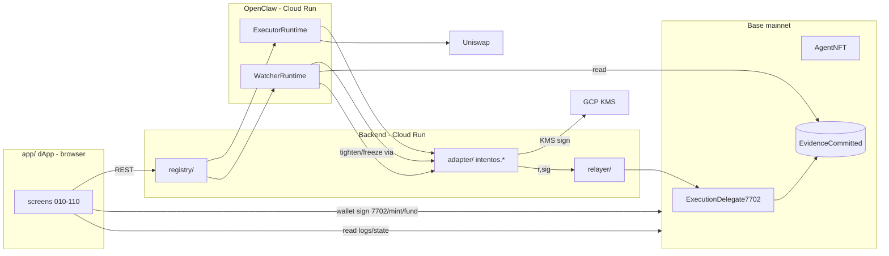

# IntentOS — SDD 0: Overview & Build Order

Software Design Document for the MVP ("B" scope). This is the bridge from the frozen interfaces to
real code.

- **Vocabulary & data contracts**: [010-interfaces.md](010-interfaces.md) (Seam Freeze). This SDD
  never redefines a type — it references the section.
- **Screens**: [/mock](../mock) realize the UI; each frontend piece is anchored to a mock file.
- **Why this exists**: per [TASK.md](../TASK.md), we build Seam Freeze -> Mock -> **SDD (per
  component)**. Each component below reads only "its 010 section(s) + its mock screen", so no single
  task needs the whole system in context.

SDD is split per component (one vertical slice, B scope):

| File | Component | Anchors |
| --- | --- | --- |
| 020 (this) | Overview, stack, end-to-end sequences, build order | 010 §3, §4, §13 |
| [030-sdd-contracts.md](030-sdd-contracts.md) | Solidity (EIP-7702 delegate, Agent NFT) | 010 §5, §6, §9, §10, §11 |
| [040-sdd-runtime.md](040-sdd-runtime.md) | Registry, OpenClaw runtime, adapter, relayer, KMS | 010 §7, §8, §10, §12 |
| [050-sdd-frontend.md](050-sdd-frontend.md) | dApp (mocks -> real) | 010 §15 + mocks |

---

## 1. Scope (MVP "B")

From North Star §6: Owner Natural Intent -> Executor Agent guarded-executes **USDC↔WETH on Base
mainnet** inside Hard Guardrails -> a **single Watcher** (quorum=1) reads evidence and can only
tighten / freeze. Everything runs on Base mainnet + Cloud Run / GCP; the only thing on the Owner's
local PC is the browser.

In scope: the full Executor vertical slice + one Watcher. Out of scope: everything under
010-interfaces §scope-boundary mirrors (multi-Watcher quorum, arbitrary tokens/DEX routing, LLM
calldata, agent fund custody, marketplace/bond/slashing, multi active intents, Reputation/Validation
registries).

---

## 2. Repository layout

Monorepo. pnpm workspace for all TS; Foundry for Solidity. (Per user conventions: pnpm not npm,
`--frozen-lockfile` in CI, `minimumReleaseAge`, Dependabot/Renovate, lockfiles committed.)

```text
intentos/
  contracts/                 Foundry project (Solidity)            -> SDD 030
    src/ ExecutionDelegate7702.sol AgentNFT.sol ...
    test/ ...
  packages/
    shared/                  TS types mirroring 010 §9/§11/§13 (single source for app code)
    adapter/                 IntentOS typed-tool HTTP service (intentos.*)   -> SDD 040
    relayer/                 gas-sponsoring tx submitter                     -> SDD 040
    registry/                Runtime Registry + Agent Package Store (Backend)-> SDD 040
    runtime/                 OpenClaw Capsule wiring + Vertex shim           -> SDD 040
  app/                       React + Vite dApp (reuses mock/ design system)  -> SDD 050
  pnpm-workspace.yaml  package.json  foundry.toml
```

`packages/shared` is the TS mirror of the frozen structs (ExecutionRequest, HardGuardState,
EvidenceCommitted, terminal states). Generated/derived from the contract ABI where possible so the
seam stays single-sourced.

---

## 3. Tech stack & key decisions

| Concern | Choice | Rationale |
| --- | --- | --- |
| Contracts | Solidity + Foundry, Base mainnet (8453) | EIP-7702 delegate code; Foundry for fast fuzz/invariant tests |
| Chain client | `viem` (TS) | first-class EIP-7702 + EIP-191 signing; one lib across app/relayer/adapter |
| Agent head | OpenClaw official image `ghcr.io/openclaw/openclaw:latest` on Cloud Run | per 010 §2; we do not fork it |
| LLM | Vertex `gemini-2.5-flash` via OpenAI-compat shim (Cloud Run ADC) | per 010 §2 |
| Typed tools | `packages/adapter` HTTP service (TS) | keeps `intentos.*` boundary language-agnostic to OpenClaw |
| SessionKey | GCP KMS secp256k1, sign digest only, 0 ETH | per 010 §5/§10; key never moves funds |
| Relayer | TS service, hot key, gas advance + vault reimbursement | per North Star "who pays gas" |
| Backend/Registry | TS service on Cloud Run + small DB (Postgres) | RuntimeRecord source of truth (010 §10) |
| Frontend | React + Vite + TS + `wagmi`/`viem` + World ID IDKit | reuses `mock/styles.css` as-is |
| Indexer | RPC `getLogs` on `EvidenceCommitted` for MVP (no subgraph) | smallest path to the shared timeline |

Decisions deliberately deferred (do not build now): subgraph/indexer service, multi-key quorum,
offchain evidence bodies, ENS gateway customization. Flagged here so the structs/services don't need
reshaping when added.

---

## 4. Component boundaries



The adapter is the **only** thing that turns an OpenClaw decision into a signed request; the contract
is the **only** final authority. This is the trust boundary of 010 §5 made concrete.

---

## 5. End-to-end sequences

### 5.1 Setup (screens 010-080)

```text
connect wallet + World ID proof            (app -> registry gate)            screen 010
speak intent -> Agent Package (IntentBuilder)                                screen 040
mint Executor AgentNFT                       (app -> AgentNFT)               screen 040
sign EIP-7702 authorization + initialize(CONSTRAINTS.json -> HardGuardState) screen 040/060
set identity: ENS subname + ERC-8004 registration                           screen 050
spawn ExecutorRuntime + bind SessionKey      (registry -> runtime)          screen 060
fundGasVault(executor lane)                   (app -> delegate)             screen 060
(optional) mint Watcher + WatcherRuntime + fund watcher lane                screen 070
start -> RUNNING                                                            screen 080
```

### 5.2 Execution happy path (screen 090)

```text
OpenClaw tick: observe_state -> decide BUY
  -> get_quote (Uniswap) -> simulate
  -> submit_execution_request:
       adapter validates args, binds quoteHash/simulationHash/evidenceRoot
       builds typed ExecutionRequest, KMS signs digest
       relayer sends submitExecutionRequest(r, sig), fronts gas
  -> ExecutionDelegate7702 checks Hard Guardrails (010 §9 order)
       inside -> execute swap from Owner balance; reimburse relayer from executor lane
       emits EvidenceCommitted (010 §11)
  -> dashboard shows the shared timeline entry
```

### 5.3 Guard -> LLM feedback loop (010 §12)

```text
Executor requests above cap
  -> adapter eth_call preflight -> revert AmountTooLarge (gas 0)
  -> adapter returns { reason:"AmountTooLarge", amountCapPerTx, cumulativeRemaining } to OpenClaw
  -> OpenClaw re-requests inside boundary -> success
  -> maxAttemptsPerTick caps retries
NEVER clamp amount in the adapter.
```

### 5.4 Watcher tighten / freeze (screens 100 -> 110)

```text
WatcherRuntime: read_evidence (EvidenceCommitted) -> judge_on_intent
  suspicious -> vote_tighten | vote_freeze
  adapter builds the call, KMS signs with watcher SessionKey
  relayer sends it, reimbursed from the watcher lane
  quorum=1 -> ExecutionDelegate7702 narrows HardGuardState immediately (monotonic tighten only)
  next Executor request that exceeds new bound -> revert
  terminal state -> tightened | frozen (010 §13) shown on screen 110
```

---

## 6. Build order (milestones)

Concrete milestones; each ends at a committable, demoable point.

```text
M0 Contracts + local proof (Foundry)
  ExecutionDelegate7702: initialize, submitExecutionRequest (full §9 check order),
    fundGasVault + relayer reimbursement, watcherTighten/watcherFreeze (monotonic), ownerStop
  AgentNFT mint + tokenURI
  Foundry tests cover every custom error + invariants (010 §14)

M1 Runtime slice (Executor only) on Base mainnet
  registry spawn/bind, adapter typed tools (read + quote + simulate + submit),
  KMS SessionKey signing, relayer gas advance/reimbursement
  end: a real small USDC->WETH guarded execution emits EvidenceCommitted

M2 Frontend slice (mocks -> live)
  wallet + World ID gate, IntentBuilder -> package -> mint -> 7702 initialize -> fund -> start
  Owner dashboard reads EvidenceCommitted + contract state -> shared timeline

M3 Watcher slice
  watcher mint + WatcherRuntime, read_evidence/judge, vote_tighten/vote_freeze (quorum=1)
  Watcher dashboard + Result screen terminal states
```

Mapping to mocks: M2 lights up 010-090; M3 lights up 070/100/110.

---

## 7. Environments, config, secrets

```text
Networks      : Base mainnet (8453). Local: anvil --fork-url <base> for M0/M1 dev.
Config        : addresses (delegate impl, AgentNFT, USDC, WETH, Uniswap router) per 010 §2.
Secrets       : KMS key refs, relayer hot key, Vertex ADC -> GCP Secret Manager / Cloud Run SA.
                NEVER in repo, NEVER in `reason`/evidence (010 §14).
CI            : pnpm install --frozen-lockfile; forge test; typecheck; per user supply-chain rules.
```

---

## 8. Open decisions / risks

- **EIP-7702 on Base mainnet**: confirm Pectra/7702 support + `viem` `signAuthorization` path on
  target RPC before M1. Fallback dev path: anvil fork.
- **Uniswap surface**: Quote/Swap API vs on-chain Quoter+UniversalRouter. MVP: on-chain Quoter +
  router with `target`/`selector` allowlist in HardGuardState (keeps everything verifiable).
- **LLM empty-output trap**: per repo memory, Vertex `maxOutputTokens` too small -> blank ->
  mis-read as HOLD. Set generous tokens (~10x), clamp min, log finishReason. (SDD 040 §observability.)
- **Reason normalization**: enforce ASCII<=200 at the adapter before signing/emitting.
