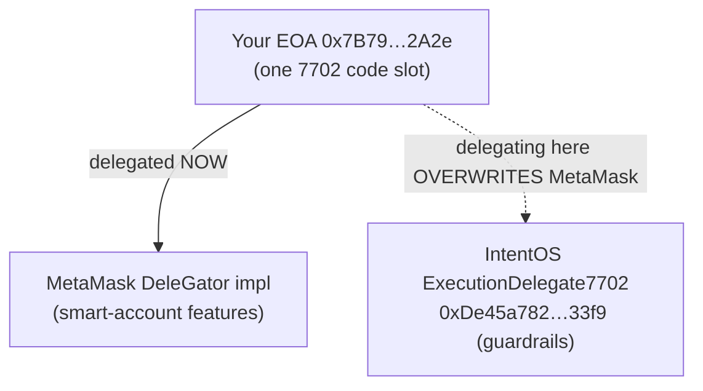
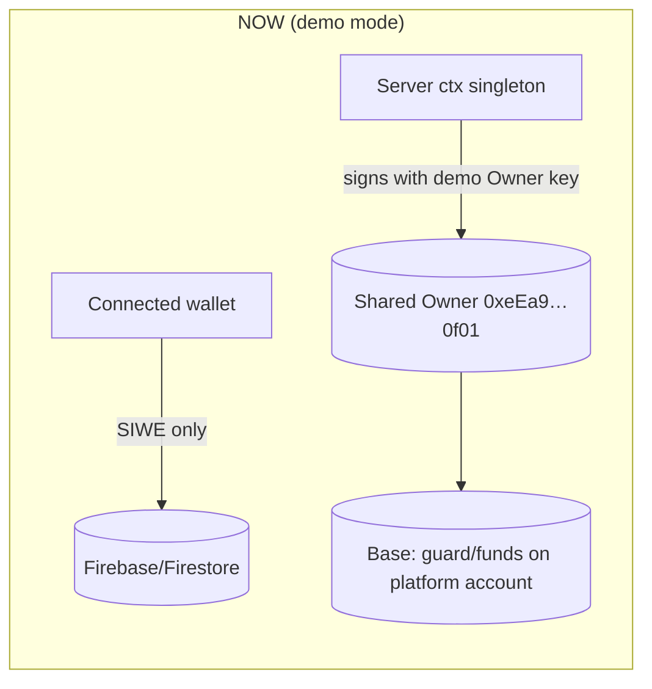
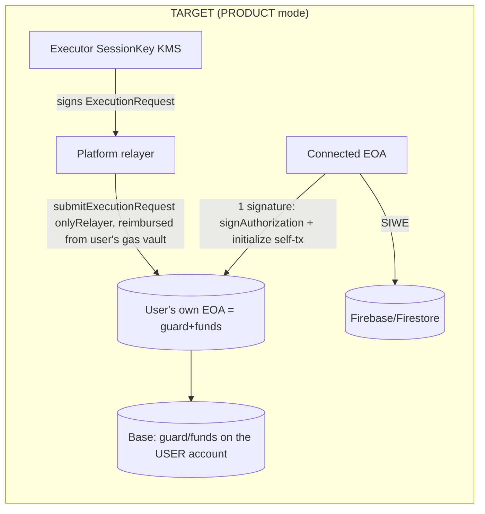

# 080 — Refactoring Plan: Per-User EIP-7702 ("PRODUCT mode")

Status: **DECIDED — self-delegate via a Local Activation Kit (Ledger-first); browser wallets can't sign
the 7702 delegation.** Owner confirmed self-delegate (2026-06-13). Live test (2026-06-14) showed MetaMask
refuses `signAuthorization` for a dApp-chosen impl, so activation moves to a local install-free CLI
(`scripts/activate-kit/`, served at `/activate-kit/activate.mjs`) that signs the EIP-7702 authorization
with a **Ledger (recommended)** or a dedicated imported key. Demo (shared-Owner) mode stays as the
fund-less-judge fallback. ERC-7579 module path is future-only (§1.3 Option C / §9).
Closes / advances QA rows: `ARCH-001` (primary), `GAS-001`, `AUTH-004`, `RPC-001`, `STORE-001`,
`WORLDID-001`. See [plan/070-qa-register.md](070-qa-register.md).

This plan turns IntentOS from a **single shared demo Owner** into a **per-user** system where every
visitor delegates **their own EOA** to the guarded-execution layer. It also explains the MetaMask
Smart Account conflict, why it is a protocol-level constraint, and how we resolve it now vs. later.

---

## 0. Why this refactor exists (the product requirement)

> "To take part in IntentOS, a person must be able to EIP-7702-delegate **their own EOA**. Otherwise
> nobody else can use it."

This is correct and is the whole point of a non-custodial guardrail layer. Today the demo does **not**
meet it:

- Every on-chain action (delegate + initialize, guarded trades, gas-vault funding, guard updates) runs
  under the **shared platform demo Owner** `0xeEa9c291544d02397FD8078e3162a3549ADa0f01`, whose key sits
  in Secret Manager (`owner-test-wallet-key`).
- The connected visitor wallet (e.g. `0x7B79…2A2e`) is used **only** for sign-in (SIWE → Firebase) and
  Firestore scoping. It is never the on-chain Owner.
- So a visitor watches an agent operate on the **platform's** funds and identity — the "your account,
  your guardrails" story does not actually hold. (`ARCH-001`.)

The good news: the contract and most of the runtime were **designed** for per-user from day one (see
§3). What is missing is wiring the **owner-side signature into the browser** and threading the
connected address through the server. No new contract deploy is required.

---

## 1. Background: MetaMask Smart Account, and why it cannot co-exist with our delegate

### 1.1 What is a "MetaMask Smart Account"?

A **MetaMask Smart Account** is MetaMask's feature that "upgrades" an ordinary EOA into a smart-contract
account **using EIP-7702** (the same mechanism IntentOS uses). When you enable it, MetaMask submits an
EIP-7702 authorization that sets your EOA's on-chain code to a **delegation indicator**:

```
account code = 0xef0100 ‖ <implementation address>
```

For MetaMask, `<implementation address>` is MetaMask's own delegator implementation (the MetaMask
**Delegation Framework** / "DeleGator"). That code gives the EOA smart-account powers: transaction
batching, gas sponsorship (paymaster), passkey / multisig signers, and **scoped delegations**
(granting another party a permission bounded by "caveats").

Your wallet `0x7B79…2A2e` currently reports code starting with `0xef0100…` — it is **already a
7702-delegated MetaMask Smart Account** (this is exactly why sign-in needed the `AUTH-004` fix:
its signatures are ERC-1271/6492/7702-style, not plain EOA `ecrecover`).

### 1.2 Why it can't co-exist with `ExecutionDelegate7702`

EIP-7702 gives each EOA **exactly one code slot**, and that slot is a **single delegation indicator
pointing to one implementation**. There is **no stacking, no composition** at the 7702 level:

- The account is delegated to MetaMask's DeleGator **OR** to IntentOS's `ExecutionDelegate7702`,
  **never both at once**.
- Signing a new authorization **overwrites** the previous one. If a MetaMask Smart Account delegates to
  IntentOS, MetaMask's smart-account behaviour stops (and vice-versa) until it is re-delegated back.

This is a **protocol-level mutual exclusion**, not a bug we can patch in our Solidity. Our `onlyOwner`
guard depends on it: an Owner self-call must have `msg.sender == address(this)` — i.e. the account is
running **our** code ([contracts/src/ExecutionDelegate7702.sol](../../contracts/src/ExecutionDelegate7702.sol#L51-L55)).



### 1.3 How we resolve it (decision)

| Option | What it means | Co-exists with MM Smart Account? | Effort | Verdict |
|---|---|---|---|---|
| **A. Winner-takes-the-slot** | User re-delegates their EOA to IntentOS (overwrites MM; reversible). Plain EOAs delegate directly. | No (mutually exclusive) | Low | superseded by D for the signature |
| **B. Dedicated EOA** | User uses a fresh EOA only for IntentOS. No conflict. | N/A (separate account) | Low | **Demo fallback** |
| **C. Compose on top of a smart account** | IntentOS becomes a **scoped permission/module** on the user's existing smart account instead of replacing its code: (C1) a MetaMask **Delegation Framework** delegation with caveats = our guardrails (only USDC↔WETH via SwapRouter, spend caps, expiry; SessionKey is the delegate), or (C2) an **ERC-7579** executor/validator module. | **Yes** | High (re-architecture, stack lock-in) | **Future / product** |
| **D. Local Activation Kit (CLI)** | The 7702 authorization + `initialize` self-tx are signed **locally** by the user's own signer — **Ledger (recommended)** or a dedicated imported key — because browser wallets refuse to sign a dApp-chosen 7702 delegation (see live finding below). Install-free single file (`viem` inlined). | Replaces the EOA's delegation (same as A), but the **signature works** | Low–Med | **CHOSEN live path** |

**LIVE FINDING (2026-06-14):** Activating via the browser wallet fails with viem
`Account type "json-rpc" is not supported. The signAuthorization Action does not support JSON-RPC
Accounts.` MetaMask (and injected wallets generally) will **only** 7702-delegate to their **own**
smart-account implementation — there is no RPC for a dApp to request delegation to an arbitrary
implementation (here `0xDe45a782…33f9`). `signAuthorization` is a **local-account-only** viem action. So the
browser path is a dead end for self-delegation; the authorization must be signed by a local key or a
hardware wallet. This is why **Option D** is the chosen real path.

**Decision for this refactor:** ship **D** as the real per-user path (local kit, Ledger-first), keep
**B** (dedicated EOA) as guidance and the shared-Owner **demo mode** as the fund-less-judge fallback.
The browser ActivateGate now detects the json-rpc limitation and hands off to the kit. Record **C** as
the post-hackathon path that lets people keep their MetaMask Smart Account and join via a scoped
delegation/module instead of replacing account code.

> Practical rule: use a **dedicated, low-value EOA** for activation. The kit warns + requires `--force`
> before overwriting an existing delegation (e.g. a MetaMask Smart Account).

### 1.4 Option D — Local Activation Kit (the chosen real path)

`scripts/activate-kit/` (source) → bundled install-free to `app/public/activate-kit/activate.mjs`
(served by the panel; `viem` inlined, Ledger external). It is **self-contained**: the impl address,
SessionKey, watcherKey, relayer, guard caps and tiny vault are baked from `deployments/base-mainnet.json`
+ the server `DEMO_GUARD`, so it needs no auth and no server round-trip. Flow:
1. Load signer — `--ledger` (recommended; experimental, needs a 7702-capable Ledger Ethereum app) or a
   dedicated imported key via `--key-file` / `MNEMONIC` / `PRIVATE_KEY` (never echoed/stored).
2. Print the derived address; detect an existing delegation (warn + `--force` to overwrite).
3. Poll Base until the EOA holds the required ETH (vault reserve + gas).
4. `signAuthorization({contractAddress: impl, executor:"self"})` + `sendTransaction` — one type-4 tx.
5. Verify the receipt + that the code is now `0xef0100‖impl`.
After activation the user signs in to the panel **with the same EOA**; the server (connected mode)
operates on it; recurring trades stay server-side (SessionKey + relayer, reimbursed from the user's
vault) — zero further user signatures. The panel `ActivateGate` catches the json-rpc error and offers a
**Download activation kit** button + an upfront "Use the Local Activation Kit (Ledger)" link.

---

## 2. Today vs. target





Key invariant that makes this cheap: **only owner-authority actions must move to the browser.** The
recurring **execution** path (SessionKey signs → relayer submits → reimbursed from the user's gas
vault) stays **server-side**, so after the one setup signature the agent runs with **zero further user
signatures**.

---

## 3. What already supports per-user (so we don't rebuild it)

- **Contract — no change.** `initialize`, `submitExecutionRequest`, gas-lane reimbursement,
  `watcherTighten/Freeze`, `ownerUpdateGuard` all key off `address(this)` = the delegating EOA. The
  impl is deployed **once** (`0xDe45a782AE5544D1D682E1cfccf9D6DDa3c833f9`); every EOA wears that same
  code with **its own storage and funds**.
- **`delegateAndInitialize(owner, …)` already takes an arbitrary `owner` Account** and merges vault
  funding into the same self-tx (Base allows only 1 in-flight tx for a freshly-delegated account) —
   [packages/runtime/src/setup7702.ts](../../packages/runtime/src/setup7702.ts#L27-L66). This is fork-tested.
- **Execution stays server-side and is per-account-safe.** The SessionKey can only act inside each
  account's on-chain guard, and only the allow-listed relayer can submit. One shared KMS SessionKey can
  serve many users for the MVP (it can never exceed a user's caps or unfreeze their guard).

The **gap** is purely: (a) the owner self-call is currently signed by the demo Owner **on the server**,
and (b) the server `ctx()` is a **singleton** bound to that one Owner.

- Singleton ctx + demo Owner: [packages/server/src/journey.ts](../../packages/server/src/journey.ts#L88-L113).
- Owner self-call sign sites (must move to browser): `delegateAndInitialize`, `ownerUpdateGuard`,
   `fundGasVault` in [packages/server/src/journey.ts](../../packages/server/src/journey.ts#L312-L345).

---

## 4. Target design (PRODUCT mode)

The launch flow gets a new **Step 0 "Activate"** placed **after sign-in and before the IntentBuilder**
(the Owner's request). Becoming an IntentOS account is now an explicit, upfront act — "upgrade your EOA
into a guarded IntentOS account" — rather than something buried inside the Executor mint.

0. **Activate (NEW, before IntentBuilder).** The browser signs **one** EIP-7702 (type-4) self-tx that
   **delegates the user's own EOA** to `ExecutionDelegate7702` and `initialize()`s it with a **default
   conservative guard** (the demo rails), the executor/watcher SessionKeys, the platform relayer, a
   small initial gas-vault reserve (from the user's own ETH), and a generic IntentOS `packageHash`:
   - `signAuthorization({ contractAddress: impl, executor: "self" })` (wagmi `useSignAuthorization` /
     viem `walletClient.signAuthorization`).
   - `sendTransaction({ to: account.address, data: initialize(defaultPlan), authorizationList: [auth] })`.
   - After this the user's EOA **is** a live IntentOS guarded account. User pays gas; the vault reserve
     is backed by the user's own ETH (no extra `value` transfer). **One signature.**
   - **Why initialize upfront with a default guard:** `initialize()` is **once-only** and `_packageHash`
     is **permanent** (no setter; `ownerUpdateGuard` updates the guard only — verified in
   [ExecutionDelegate7702.sol](../../contracts/src/ExecutionDelegate7702.sol#L77-L103)). This matches how
     the system already works (packageHash set once; per-intent specificity comes from the guard + the
     off-chain FIXed draft). Binding a per-intent `packageHash` on-chain is a future refinement.
1. **Server stops holding owner authority.** `ctx()` becomes **per-connected-address** (uid is already
   `eip155:8453:<addr>`); `owner` becomes a **view-only address**, not a signer.
2. **New endpoint `POST /api/activate/plan`** returns the **unsigned** `initialize(...)` params (default
   guard via `guardFromDraft(null)`, SessionKeys, relayer, caps, small vault, generic packageHash) —
   just the calldata the browser will send. No signing server-side. (No FIXed package needed; this runs
   before the IntentBuilder.)
3. **Executor step (after FIX) = mint + optional guard update.** Mint the AgentNFT (server-side, keyed
   to the connected EOA). If the FIXed package's guard differs from the on-chain guard, the browser
   signs `ownerUpdateGuard` (one more sig); for the MVP everything clamps to the same demo rails, so
   this is normally a **no-op**. delegate+initialize is no longer here (moved to Activate).
4. **State + trade read/write the user's account.** `/api/state.delegate` and `trade()` use the
   connected EOA; SessionKey(KMS) signing + relayer submit are unchanged. Gas-vault top-ups
   (`fundGasVault`, `onlyOwner`) also become browser-signed.
5. **Demo-mode toggle stays.** Keep the shared-Owner path behind a flag for fund-less judges
   (`INTENTOS_OWNER=demo|connected`). Build `connected` **alongside** `demo` so the live demo never
   breaks; flip the default once the per-user path is proven.

Funds the user must hold on Base: **~0.001 USDC** (trade) + **a little ETH** (Activate-tx gas + gas-vault
reserve, ~0.003 ETH). Tiny amounts only, per repo policy.

### New launch-flow step order

| # | Step | On-chain owner signature? | Notes |
|---|---|---|---|
| 0 | **Activate** (NEW) | **Yes — 1 tx** (delegate + initialize) | after sign-in, before IntentBuilder; gates the rest |
| 1 | Intent & Agent Packages (IntentBuilder) | no | unchanged |
| 2 | Executor | only if guard ≠ on-chain (usually no-op) | mint AgentNFT (server) + optional `ownerUpdateGuard` |
| 3 | Watcher | no (mint) | unchanged |
| 4 | Gas Funding | yes, if topping up (`fundGasVault`) | optional; Activate seeds an initial reserve |
| 5 | Start Conditions | no | unchanged |

After Activate, recurring guarded trades are **server-side** (SessionKey + relayer) — **zero further
user signatures** for normal operation.

---

## 5. Work breakdown — ordered, with priorities

Priority key: **P0** = unblock/confidence (cheap, do first), **P1** = the per-user core, **P2** =
UX/honesty cleanups the refactor touches, **P3** = remaining product gaps.

### Phase 0 (P0) — close out near-done QA items (hours, no architecture change)
0.1 **`AUTH-004` — confirm smart-account sign-in live.** Manually sign in with the real 7702 wallet
   `0x7B79…2A2e` on the deployed panel; confirm `/api/auth/web3` → Firebase handshake returns 200.
   (Code already deployed in rev `00011-fhm`.)
0.2 **`RPC-001` — verify write-path after deploy.** Run a gas-vault top-up + one guarded trade against
   the live panel; confirm no 5xx and honest success/revert (the `TX-001` fix is now live).
0.3 **Decide nonce-store vs. instances.** In-memory nonce ring buffer (`AUTH-005`) assumes a single
   instance. Either keep `--max-instances 1`, or move the nonce store to Firestore so `max-instances`
   can grow. Pick one and record it. (Current deploys have drifted between 1 and 2.)

### Phase 1 (P1) — per-user EIP-7702 core (`ARCH-001`)
Build the `connected` path **alongside** `demo` (INTENTOS_OWNER toggle) so the live demo never breaks.
1.1 **Server `ctx()` → per-address.** Replace the singleton in
   [journey.ts](../../packages/server/src/journey.ts#L88-L113) with a small per-address cache; derive the
   address from the authenticated uid; in `connected` mode `owner` is a view-only `Address` (no signer).
1.2 **Add `POST /api/activate/plan`** → returns the unsigned `initialize(...)` params with a **default**
   conservative guard (`guardFromDraft(null)`), SessionKeys, relayer, caps, a small vault, and a generic
   packageHash. (No FIXed package needed — runs before the IntentBuilder.)
1.3 **New "Activate" step in [app/src/LaunchFlow.tsx](../../app/src/LaunchFlow.tsx)** placed **before** the
   Intent step: `signAuthorization` + `initialize` self-tx via wagmi/viem (one type-4 tx); confirm →
   notify server. Gate the rest of the wizard on `state.delegated` for the connected EOA.
1.4 **Executor step = mint + optional guard update.** Remove delegate+initialize from here; mint the
   AgentNFT keyed to the connected EOA; if the FIXed guard differs from on-chain, browser-sign
   `ownerUpdateGuard` (else no-op).
1.5 **Thread the connected address** through `/api/state` (`delegate`), `trade()`, `fundGas()`,
   `ownerResume()`, `reset()` so they read/write the **user's** account. `fundGasVault` &
   `ownerUpdateGuard` become browser-signed (owner-authority).
1.6 **Guardrail: detect an already-delegated non-IntentOS account.** If the connected EOA's code is
   `0xef0100‖<other impl>` (e.g. a MetaMask Smart Account), warn ("Activating overwrites your current
   smart-account delegation — use a fresh EOA") and require explicit confirm. (§1.3 demo rule.)
1.7 **Tests.** Fork/e2e: per-address ctx; `/api/activate/plan` shape; Activate browser-tx mocked in
   Playwright; one real tiny per-user delegate+trade on Base with a fresh EOA.

### Phase 2 (P2) — UX / honesty the refactor touches
2.1 **`GAS-001` — gas-funding model.** With per-user funding, decide the copy/UX: either keep two lanes
   ("Executor tx gas" vs "Watcher vote gas") with a clear explanation, or collapse to one "Runtime gas
   reserve" with advanced details. The user funds their **own** vault now, so this must read honestly.
2.2 **`ARCH-001` → resolved/toggle.** Flip the QA row to "Fixed (PRODUCT mode)" once Phase 1 ships;
   keep demo mode documented as the fallback.

### Phase 3 (P3) — remaining product gaps (post-core)
3.1 **`WORLDID-001`** — wire real `@worldcoin/idkit` when `VITE_WORLDID_APP_ID` is set (gate logic
   already supports it).
3.2 **`STORE-001`** — refuse `INTENTOS_STORE=memory` on Cloud Run unless a deliberate break-glass env
   is set.
3.3 **Periodic execution** — a **bounded** Cloud Scheduler/Tasks tick to replace the manual trade
   button (must stay capped: short loop, `MAX_PLANNED_TICKS`, hard autostop).
3.4 **Future (Option C)** — spike IntentOS guardrails as a MetaMask **Delegation Framework** caveat set
   or **ERC-7579** module, so users keep their MetaMask Smart Account and join via a scoped permission
   instead of a re-delegation.

---

## 6. Risks & pitfalls

- **MetaMask Smart Account overwrite** (the big one). Delegating an MM-Smart-Account EOA to IntentOS
  replaces MM's delegation. Mitigation: §1.3 demo rule (fresh EOA) + §5.1.6 detection/warn.
- **Single in-flight tx for a freshly-delegated account on Base** → keep vault funding **inside**
  `initialize()` (already done); the browser does exactly one setup tx.
- **7702 self-tx nonce handling** in the browser (authorization nonce vs. tx nonce when `executor:
  "self"`). Validate that the chosen wallet (MetaMask) signs and broadcasts a type-4 self-tx correctly;
  fall back to a 2-step (authorize, then initialize) if needed.
- **Shared KMS SessionKey across users** — acceptable for MVP (constrained per-account by on-chain
  guard, relayer-gated). Production should derive per-user session keys.
- **Nonce store vs. `max-instances`** — see §5.0.3; don't scale out with an in-memory nonce store.
- **Funding UX** — the demo breaks if the user's EOA lacks USDC/ETH; surface a clear pre-flight check.

---

## 7. Acceptance criteria (definition of done for Phase 1)

- A **fresh plain EOA** connects, signs in, and in the **Activate** step (before the IntentBuilder)
  signs **one** MetaMask transaction that delegates **its own** account to `ExecutionDelegate7702` and
  initializes the guard.
- `/api/state.delegate` shows the **connected EOA** (not `0xeEa9…0f01`); guard/vaults/balances are read
  from that account.
- A guarded USDC→WETH trade executes via SessionKey + relayer, reimbursed from the **user's** gas vault,
  and the UI shows honest success/revert (`TX-001`).
- Demo mode (shared Owner) still works behind the toggle for fund-less judges.
- QA `ARCH-001` flips to Fixed (PRODUCT mode); `GAS-001` copy updated; `AUTH-004`/`RPC-001` confirmed.

---

## 8. Open questions for the Owner (blockers before Phase 1)

1. **Dedicated EOA?** Use a **new plain EOA** for the live per-user demo (recommended), or accept
   overwriting `0x7B79…2A2e`'s MetaMask Smart Account?
2. **Funding?** Can that EOA hold **~0.001 USDC + a little Base ETH**?
3. **Scale/nonce decision** (§5.0.3): keep `--max-instances 1`, or move the nonce store to Firestore?

---

## 9. Appendix: EIP-7702 vs ERC-7579 (why self-delegate now, modules later)

The Owner asked how 7702 and 7579 differ. They are **different layers and do not compete** — they
compose. This is why "keep our own delegate" (now) and "become a module" (future) are both coherent.

| | **EIP-7702** | **ERC-7579** |
|---|---|---|
| Layer | Core **protocol** (Pectra, 2025-05) | App-level **interface standard** (ERC, Draft) |
| Decides | **How an EOA sets its code** (`0xef0100‖impl` delegation designator, tx type `0x04`) | **How a smart account is structured** as installable modules |
| Unit | EOA's **single** code slot → one implementation | One implementation hosting **many** modules |
| Module types | n/a | Validator (1), Executor (2), Fallback (3), Hook (4) |
| Solves | "Upgrade my EOA into a smart account" | "Reuse modules across wallets; avoid vendor lock-in" |
| Depends on | nothing (L1) | ERC-4337 validation flow (bundler/paymaster/EntryPoint) |
| IntentOS today | **used** (EOA → our own delegate) | **not used** (our delegate is monolithic, non-modular) |

**Why this matters for IntentOS.** Our `ExecutionDelegate7702` is a **monolithic** 7702 delegate: it
occupies the EOA's whole code slot and hard-codes guard + SwapRouter + SessionKey + relayer + gas
vault. That is exactly why it **cannot co-exist** with a MetaMask Smart Account (one code slot, mutual
exclusion). It also means adding features needs an impl redeploy + everyone re-delegating.

**Future Option C (post-hackathon).** Express IntentOS guardrails as **installable modules** on a
generic modular account (which itself wears 7702 code), instead of replacing the account's code:
- **Executor module (type 2)** — perform swaps inside the guard.
- **Hook module (type 4)** — enforce HardGuard in `preCheck`/`postCheck` around every execution.
- **Validator module (type 1)** — verify SessionKey signatures.
Because modules are **installed, not substituted**, this **removes the MetaMask conflict** and lets a
user keep their existing smart account. Two sub-paths: **C1** = MetaMask **Delegation Framework**
caveats (MetaMask-native); **C2** = an **ERC-7579** account (Safe7579 / Kernel / Nexus) where IntentOS
is a module. Trade-off: 7579 pulls in **ERC-4337** infra, a medium-to-large re-architecture.

**Reuse signal found during research.** The 7579 ecosystem already ships primitives IntentOS hand-rolls
— **Smart Sessions** with `SpendingLimits` / `TimeFrame` / `ValueLimit` / `UsageLimit` policies (= our
SessionKey + hard rails) and a **Scheduled Orders** executor with `getSwapOrderData` (= our periodic
swap). So Option C is not just compatible; it lets us **stand on standard modules** and focus IntentOS
on its real differentiator: the **Watcher + EvidenceCommitted** monitoring/tighten/freeze layer. The
long-term vision is "**IntentOS = a Watcher/Evidence Hook module**" that plugs into any modular account.
**Out of scope for the hackathon** — recorded so we don't lose it.
