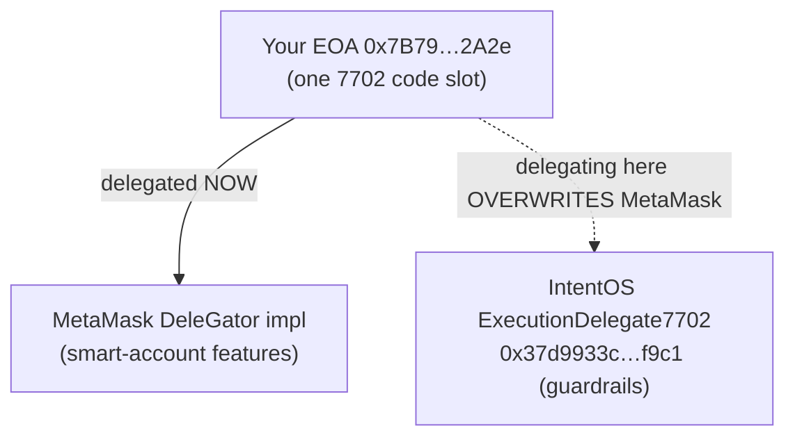
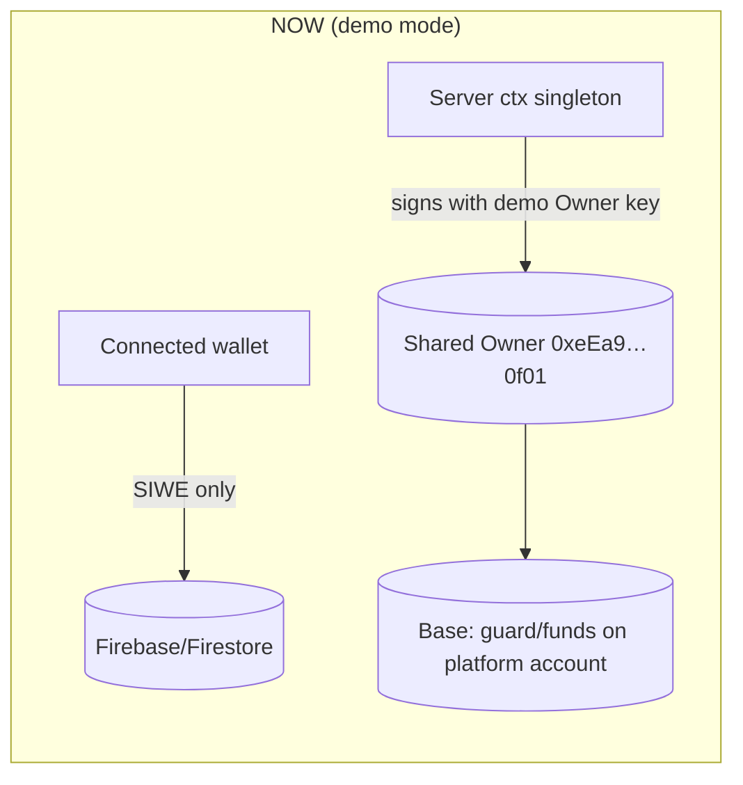
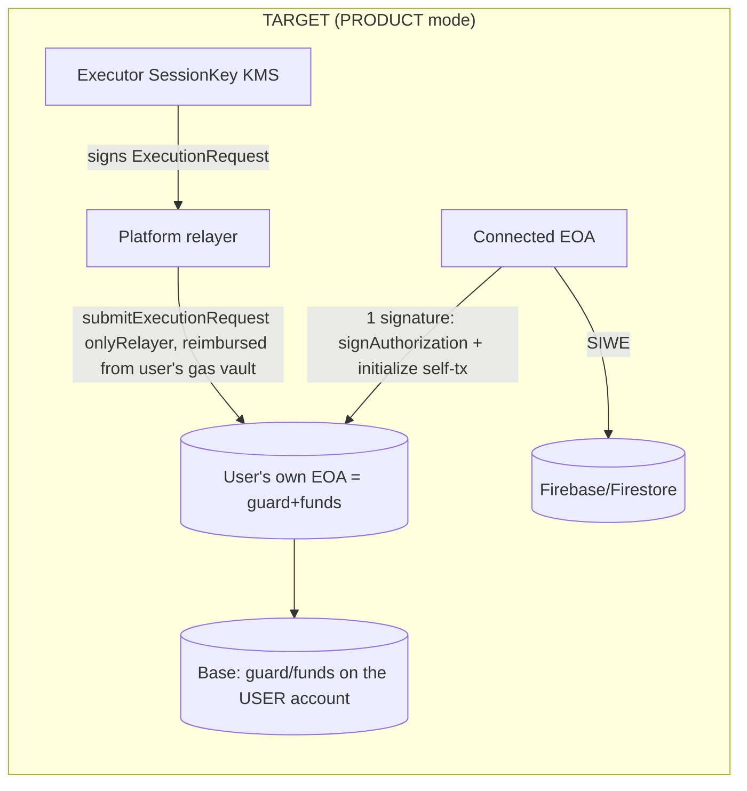

# 080 — Refactoring Plan: Per-User EIP-7702 ("PRODUCT mode")

Status: **proposed**. Owner sign-off needed before Phase 1.
Closes / advances QA rows: `ARCH-001` (primary), `GAS-001`, `AUTH-004`, `RPC-001`, `STORE-001`,
`WORLDID-001`. See [plan/070-qa-register.md](070-qa-register.md).

This plan turns IntentOS from a **single shared demo Owner** into a **per-user** system where every
visitor delegates **their own EOA** to the guarded-execution layer. It also explains the MetaMask
Smart Account conflict, why it is a protocol-level constraint, and how we resolve it now vs. later.

---

## 0. Why this refactor exists (the product requirement)

> "To take part in IntentOS, a person must be able to EIP-7702-delegate **their own EOA**. Otherwise
> nobody else can use it."

This is correct and is the whole point of a non-custodial guardrail layer. Today the demo does **not**
meet it:

- Every on-chain action (delegate + initialize, guarded trades, gas-vault funding, guard updates) runs
  under the **shared platform demo Owner** `0xeEa9c291544d02397FD8078e3162a3549ADa0f01`, whose key sits
  in Secret Manager (`owner-test-wallet-key`).
- The connected visitor wallet (e.g. `0x7B79…2A2e`) is used **only** for sign-in (SIWE → Firebase) and
  Firestore scoping. It is never the on-chain Owner.
- So a visitor watches an agent operate on the **platform's** funds and identity — the "your account,
  your guardrails" story does not actually hold. (`ARCH-001`.)

The good news: the contract and most of the runtime were **designed** for per-user from day one (see
§3). What is missing is wiring the **owner-side signature into the browser** and threading the
connected address through the server. No new contract deploy is required.

---

## 1. Background: MetaMask Smart Account, and why it cannot co-exist with our delegate

### 1.1 What is a "MetaMask Smart Account"?

A **MetaMask Smart Account** is MetaMask's feature that "upgrades" an ordinary EOA into a smart-contract
account **using EIP-7702** (the same mechanism IntentOS uses). When you enable it, MetaMask submits an
EIP-7702 authorization that sets your EOA's on-chain code to a **delegation indicator**:

```
account code = 0xef0100 ‖ <implementation address>
```

For MetaMask, `<implementation address>` is MetaMask's own delegator implementation (the MetaMask
**Delegation Framework** / "DeleGator"). That code gives the EOA smart-account powers: transaction
batching, gas sponsorship (paymaster), passkey / multisig signers, and **scoped delegations**
(granting another party a permission bounded by "caveats").

Your wallet `0x7B79…2A2e` currently reports code starting with `0xef0100…` — it is **already a
7702-delegated MetaMask Smart Account** (this is exactly why sign-in needed the `AUTH-004` fix:
its signatures are ERC-1271/6492/7702-style, not plain EOA `ecrecover`).

### 1.2 Why it can't co-exist with `ExecutionDelegate7702`

EIP-7702 gives each EOA **exactly one code slot**, and that slot is a **single delegation indicator
pointing to one implementation**. There is **no stacking, no composition** at the 7702 level:

- The account is delegated to MetaMask's DeleGator **OR** to IntentOS's `ExecutionDelegate7702`,
  **never both at once**.
- Signing a new authorization **overwrites** the previous one. If a MetaMask Smart Account delegates to
  IntentOS, MetaMask's smart-account behaviour stops (and vice-versa) until it is re-delegated back.

This is a **protocol-level mutual exclusion**, not a bug we can patch in our Solidity. Our `onlyOwner`
guard depends on it: an Owner self-call must have `msg.sender == address(this)` — i.e. the account is
running **our** code ([contracts/src/ExecutionDelegate7702.sol](../contracts/src/ExecutionDelegate7702.sol#L51-L55)).



### 1.3 How we resolve it (decision)

| Option | What it means | Co-exists with MM Smart Account? | Effort | Verdict |
|---|---|---|---|---|
| **A. Winner-takes-the-slot** | User re-delegates their EOA to IntentOS (overwrites MM; reversible). Plain EOAs delegate directly. | No (mutually exclusive) | Low | **MVP path** |
| **B. Dedicated EOA** | User uses a fresh EOA only for IntentOS. No conflict. | N/A (separate account) | Low | **Demo default** |
| **C. Compose on top of a smart account** | IntentOS becomes a **scoped permission/module** on the user's existing smart account instead of replacing its code: (C1) a MetaMask **Delegation Framework** delegation with caveats = our guardrails (only USDC↔WETH via SwapRouter, spend caps, expiry; SessionKey is the delegate), or (C2) an **ERC-7579** executor/validator module. | **Yes** | High (re-architecture, stack lock-in) | **Future / product** |

**Decision for this refactor:** ship **A + B** now (own `ExecutionDelegate7702`, the user delegates
their **own** EOA; recommend a dedicated EOA so we never fight MetaMask's UI during the demo). Record
**C** as the post-hackathon path that lets people keep their MetaMask Smart Account and still join, by
expressing IntentOS guardrails as a *delegation/module* rather than a *replacement* of account code.

> Practical demo rule: **do not** delegate `0x7B79…2A2e` (it would overwrite MetaMask Smart Account).
> Create a **new plain EOA** for the live per-user demo.

---

## 2. Today vs. target





Key invariant that makes this cheap: **only owner-authority actions must move to the browser.** The
recurring **execution** path (SessionKey signs → relayer submits → reimbursed from the user's gas
vault) stays **server-side**, so after the one setup signature the agent runs with **zero further user
signatures**.

---

## 3. What already supports per-user (so we don't rebuild it)

- **Contract — no change.** `initialize`, `submitExecutionRequest`, gas-lane reimbursement,
  `watcherTighten/Freeze`, `ownerUpdateGuard` all key off `address(this)` = the delegating EOA. The
  impl is deployed **once** (`0x37d9933c5ac95399c840d3a2c07fdfdbc8b7f9c1`); every EOA wears that same
  code with **its own storage and funds**.
- **`delegateAndInitialize(owner, …)` already takes an arbitrary `owner` Account** and merges vault
  funding into the same self-tx (Base allows only 1 in-flight tx for a freshly-delegated account) —
  [packages/runtime/src/setup7702.ts](../packages/runtime/src/setup7702.ts#L27-L66). This is fork-tested.
- **Execution stays server-side and is per-account-safe.** The SessionKey can only act inside each
  account's on-chain guard, and only the allow-listed relayer can submit. One shared KMS SessionKey can
  serve many users for the MVP (it can never exceed a user's caps or unfreeze their guard).

The **gap** is purely: (a) the owner self-call is currently signed by the demo Owner **on the server**,
and (b) the server `ctx()` is a **singleton** bound to that one Owner.

- Singleton ctx + demo Owner: [packages/server/src/journey.ts](../packages/server/src/journey.ts#L88-L113).
- Owner self-call sign sites (must move to browser): `delegateAndInitialize`, `ownerUpdateGuard`,
  `fundGasVault` in [packages/server/src/journey.ts](../packages/server/src/journey.ts#L312-L345).

---

## 4. Target design (PRODUCT mode)

1. **Server stops holding owner authority.** `ctx()` becomes **per-connected-address** (uid is already
   `eip155:8453:<addr>`), and `owner` becomes a **view-only address**, not a signer. The server never
   signs an owner self-call.
2. **New endpoint `POST /api/executor/plan`** returns the **unsigned** `initialize(...)` parameters
   computed from the user's FIXed Executor package: the `HardGuardState` struct, `sessionKey`,
   `watcherKey`, `relayer` (platform), `gasPerTxCap`, `initialExecVault`, `initialWatcherVault`,
   `packageHash`, `semanticGuardHash`. (No signing; just the calldata the browser will send.)
3. **Browser does the one owner transaction** in the Executor step:
   - `signAuthorization({ contractAddress: impl, executor: "self" })`
     (wagmi `useSignAuthorization` / viem `walletClient.signAuthorization`).
   - `sendTransaction({ to: account.address, data: initialize(plan), authorizationList: [auth] })`
     — a single EIP-7702 (type-4) self-tx; user pays gas; the vault reserve is backed by the user's own
     ETH balance (no extra `value` transfer needed).
   - On confirm, notify the server "this EOA is delegated"; AgentNFT mint can stay server-side.
4. **State + trade read/write the user's account.** `/api/state.delegate` and `trade()` use the
   connected EOA; SessionKey(KMS) signing + relayer submit are unchanged.
5. **Demo-mode toggle stays.** Keep the shared-Owner path behind a flag for fund-less judges
   (`INTENTOS_OWNER=demo|connected`, default `connected` in PRODUCT mode).

Funds the user must hold on Base: **~0.001 USDC** (trade) + **a little ETH** (init-tx gas + gas-vault
reserve). Tiny amounts only, per repo policy.

---

## 5. Work breakdown — ordered, with priorities

Priority key: **P0** = unblock/confidence (cheap, do first), **P1** = the per-user core, **P2** =
UX/honesty cleanups the refactor touches, **P3** = remaining product gaps.

### Phase 0 (P0) — close out near-done QA items (hours, no architecture change)
0.1 **`AUTH-004` — confirm smart-account sign-in live.** Manually sign in with the real 7702 wallet
   `0x7B79…2A2e` on the deployed panel; confirm `/api/auth/web3` → Firebase handshake returns 200.
   (Code already deployed in rev `00011-fhm`.)
0.2 **`RPC-001` — verify write-path after deploy.** Run a gas-vault top-up + one guarded trade against
   the live panel; confirm no 5xx and honest success/revert (the `TX-001` fix is now live).
0.3 **Decide nonce-store vs. instances.** In-memory nonce ring buffer (`AUTH-005`) assumes a single
   instance. Either keep `--max-instances 1`, or move the nonce store to Firestore so `max-instances`
   can grow. Pick one and record it. (Current deploys have drifted between 1 and 2.)

### Phase 1 (P1) — per-user EIP-7702 core (`ARCH-001`)
1.1 **Server `ctx()` → per-address.** Replace the singleton in
   [journey.ts](../packages/server/src/journey.ts#L88-L113) with a small per-address cache; derive the
   address from the authenticated uid; make `owner` a view-only `Address` (no signer).
1.2 **Add `POST /api/executor/plan`** → returns the unsigned `initialize(...)` params (§4.2). Reuse
   `guardFromDraft()` clamping to demo rails (≤2000/tx, ≤0.1 cumulative).
1.3 **Browser owner-tx in the Executor step** of
   [app/src/LaunchFlow.tsx](../app/src/LaunchFlow.tsx): `signAuthorization` + `initialize` self-tx via
   wagmi/viem; show MetaMask "delegate + initialize" as **one** transaction; confirm → notify server.
1.4 **Thread the connected address** through `/api/state` (`delegate`), `trade()`, `fundGas()`,
   `ownerResume()`, `reset()` so they read/write the **user's** account. Remove server-side owner
   signing for these (owner-authority ones become browser-driven; `fundGasVault` & `ownerUpdateGuard`
   move to the same browser self-tx pattern as needed).
1.5 **Mint flow** keys AgentNFT to the connected EOA (mint can stay server-side; just pass the address).
1.6 **Guardrail: refuse to delegate an already-delegated non-IntentOS account by default.** Detect
   `0xef0100‖<other impl>` and warn ("this would overwrite your MetaMask Smart Account — use a fresh
   EOA"). Allow an explicit override. (Implements the §1.3 demo rule.)
1.7 **Tests.** Fork/e2e: per-address ctx; `/api/executor/plan` shape; browser-tx mocked in Playwright;
   one real tiny per-user delegate+trade on Base with a fresh EOA.

### Phase 2 (P2) — UX / honesty the refactor touches
2.1 **`GAS-001` — gas-funding model.** With per-user funding, decide the copy/UX: either keep two lanes
   ("Executor tx gas" vs "Watcher vote gas") with a clear explanation, or collapse to one "Runtime gas
   reserve" with advanced details. The user funds their **own** vault now, so this must read honestly.
2.2 **`ARCH-001` → resolved/toggle.** Flip the QA row to "Fixed (PRODUCT mode)" once Phase 1 ships;
   keep demo mode documented as the fallback.

### Phase 3 (P3) — remaining product gaps (post-core)
3.1 **`WORLDID-001`** — wire real `@worldcoin/idkit` when `VITE_WORLDID_APP_ID` is set (gate logic
   already supports it).
3.2 **`STORE-001`** — refuse `INTENTOS_STORE=memory` on Cloud Run unless a deliberate break-glass env
   is set.
3.3 **Periodic execution** — a **bounded** Cloud Scheduler/Tasks tick to replace the manual trade
   button (must stay capped: short loop, `MAX_PLANNED_TICKS`, hard autostop).
3.4 **Future (Option C)** — spike IntentOS guardrails as a MetaMask **Delegation Framework** caveat set
   or **ERC-7579** module, so users keep their MetaMask Smart Account and join via a scoped permission
   instead of a re-delegation.

---

## 6. Risks & pitfalls

- **MetaMask Smart Account overwrite** (the big one). Delegating an MM-Smart-Account EOA to IntentOS
  replaces MM's delegation. Mitigation: §1.3 demo rule (fresh EOA) + §5.1.6 detection/warn.
- **Single in-flight tx for a freshly-delegated account on Base** → keep vault funding **inside**
  `initialize()` (already done); the browser does exactly one setup tx.
- **7702 self-tx nonce handling** in the browser (authorization nonce vs. tx nonce when `executor:
  "self"`). Validate that the chosen wallet (MetaMask) signs and broadcasts a type-4 self-tx correctly;
  fall back to a 2-step (authorize, then initialize) if needed.
- **Shared KMS SessionKey across users** — acceptable for MVP (constrained per-account by on-chain
  guard, relayer-gated). Production should derive per-user session keys.
- **Nonce store vs. `max-instances`** — see §5.0.3; don't scale out with an in-memory nonce store.
- **Funding UX** — the demo breaks if the user's EOA lacks USDC/ETH; surface a clear pre-flight check.

---

## 7. Acceptance criteria (definition of done for Phase 1)

- A **fresh plain EOA** connects, signs in, and in the Executor step signs **one** MetaMask transaction
  that delegates **its own** account to `ExecutionDelegate7702` and initializes the guard.
- `/api/state.delegate` shows the **connected EOA** (not `0xeEa9…0f01`); guard/vaults/balances are read
  from that account.
- A guarded USDC→WETH trade executes via SessionKey + relayer, reimbursed from the **user's** gas vault,
  and the UI shows honest success/revert (`TX-001`).
- Demo mode (shared Owner) still works behind the toggle for fund-less judges.
- QA `ARCH-001` flips to Fixed (PRODUCT mode); `GAS-001` copy updated; `AUTH-004`/`RPC-001` confirmed.

---

## 8. Open questions for the Owner (blockers before Phase 1)

1. **Dedicated EOA?** Use a **new plain EOA** for the live per-user demo (recommended), or accept
   overwriting `0x7B79…2A2e`'s MetaMask Smart Account?
2. **Funding?** Can that EOA hold **~0.001 USDC + a little Base ETH**?
3. **Scale/nonce decision** (§5.0.3): keep `--max-instances 1`, or move the nonce store to Firestore?
